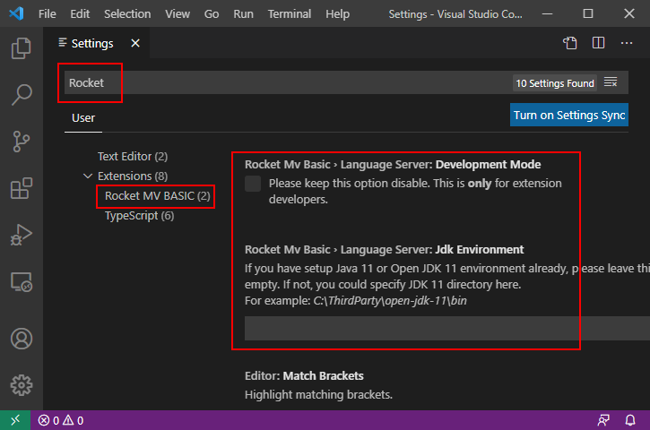
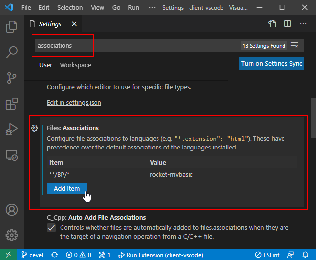

## About The Project

Rocket MV BASIC for VS code is a free Visual Studio Code Extension created by Rocket Software. The purpose of this extension is to enable BASIC developers to develop MV BASIC applications in one of the most popular development platforms- Microsoft Visual Studio Code. Rocket MV BASIC for VS code provides users with a first-rate editing experience.

## Features

This extension includes the following features:

 - BASIC statements / keywords highlighting;
 - Semantic highlighting;
 - Symbols collection / outline on the current document;
 - Code folding;
 - Go to / Peek definition on current document or crossing different files;
 - Rename symbols for same type;
 - Find symbol references in current and crossing different files;
 - Hover over a statement to show its documentation;
 - Document formatting, range formatting and on typing formatting;
 - Detail settings for formatting;
 - Auto-Completion for BASIC statements, keywords and symbols;
 - Connect to U2 MultiValue server and cache cataloged programs to local machine when necessary;
 - Auto-Group files and customize the group rules;
 - Add customized documentation for functions, subroutines or labels;
- Show syntax and grammar errors;
 - Prompt parameters of BASIC functions
## Restriction

Currently the extension is only used to edit BASIC program files on local machine.

## Getting Started

### Installation

Install Java 11 or setup the Java 11 environment following the **Configurations** section.

VS Code 1.50 or higher version is required.

Download and install the Rocket MV BASIC extension from VS Code marketplace.

### Configurations

After successfully installing the extension, some configuration is required before using it.

Press <kbd>F1</kbd> to open the command input box, then enter "Open Settings (UI)" to open the configuration page (or use "Open Settings (JSON)" to open a json format configuration page).

From the settings page, enter "Rocket" in the input box to display all configuration items for the extension (or expand the **Extensions** item and select **Rocket MV BASIC**).

- `Language Server: Development Mode`

    This item is only for extension developers. Please ensure that this item's state is always **unchecked**.

- `Language Server: JDK Environment`

    If you do not have a Java environment, or you do not want to upgrade your existing Java environment to version 11, complete these steps to set up a Java 11 environment:

    *Step 1*. Download the Open JDK 11 zip file from [this page](http://jdk.java.net/archive/).

    *Step 2*. Unzip the downloaded zip file to a temporary location on your system (for example, "*C:\temp\jdk-11*").

    *Step 3*. Enter the path of the bin directory in the input box of the configuration item (see the screenshot above).

    **Note**: Using this method, an existing working environment that requires a different version of Java would not be impacted and the extension will work properly in the Java 11 environment.

### Start Extension

Currently, the extension is used to edit BASIC program files on local machine only. You need to manually pull and push the BASIC files to U2 server.

Before activating the extension, you need open an U2 MultiValue account folder in VS Code.

You can activate the extension using the command "Activate Rocket MV BASIC". Press F1 and then enter the command. Or you can open a BASIC program file which will automatically activate the extension. (By default, the extension is automatically activated when opening a file with the suffix ".B").  If your BASIC program files don't end with a ".B" postfix, you can customize the rules for activating the extension in VS Code.

Press <kbd>F1</kbd> to open a command line in VS Code, then enter "*Open Settings (UI)*" to open the settings page.

Search "*associations*" in the settings page and find the setting "*Files: Associations*". Add an item in this setting (the item content accepts a  [glob pattern](https://en.wikipedia.org/wiki/Glob_(programming))).

For example, the item in the screenshot above means the Rocket MV BASIC extension will be activated when any file in the BP folder is opened. 

## Usage

Please click the links below to learn more about using each feature.

- [Auto-completion](./usage/Completion.md)
- [Auto-group view](./usage/GroupView.md)
- [Code Folding](./usage/Folding.md)
- [Configurations](./usage/Configuration.md)
- [Connect to U2 server](./usage/Connection.md)
- [Customized documentation](./usage/CustomizeDoc.md)
- [Document symbols](./usage/DocumentSymbol.md)
- [Diagnostics](./usage/Diagnostics.md)
- [Find references](./usage/References.md)
- [Formatting](./usage/Formatting.md)
- [Go to definition](./usage/Definition.md)
- [Hover](./usage/Hover.md)
- [Rename](./usage/Rename.md)
- [Semantic highlighting](./usage/SemanticHighlighting.md)
- [Signature Help](./usage/SignatureHelp.md)

## Contact Us

Please visit our [forum](https://community.rocketsoftware.com/forums) for more information