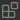
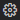
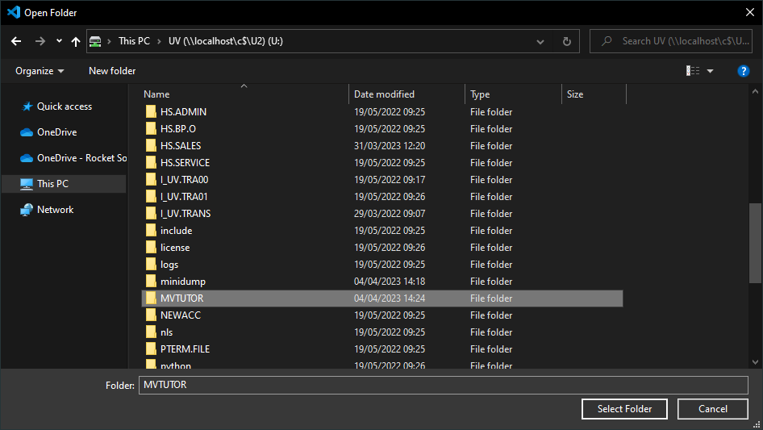

# Rocket MV Basic for VS Code

Rocket MV BASIC for VS Code is a free Visual Studio Code extension created by Rocket Software. This extension enables BASIC developers to modernize their MultiValue applications in one of the most popular development platforms with an exceptional editing experience.

## Features

This extension allows:

 - Highlight BASIC statements and keywords
 - Semantic highlighting
 - Go to and Peek definition of includes and subroutines across files
 - Auto-completing BASIC statements, keywords, and symbols
 - Compiling, Debugging, and Cataloging BASIC programs on a U2 server

To see [all features](./usage/Features.md).

## Restriction

Editing BASIC programs is only supported on the machine where VS Code is installed.  Direct online editing on remote MultiValue servers is not yet supported.

## Get started

Requirements:

1. [VS Code](https://code.visualstudio.com/) version 1.70.2 or higher.
2. [JDK](https://www.oracle.com/java/technologies/downloads/) or [OpenJDK](https://openjdk.org/projects/jdk/20/) version 11 or higher.

### Install & configure the extension

Install and start using the Rocket MV Basic extension.

1. Open **Visual Studio Code**.
2. Click the **Extensions** icon  (<kbd>CTRL</kbd> + <kbd>SHIFT</kbd> + <kbd>X</kbd>).  
    This opens the **EXTENSIONS** panel.

3. Search for **Rocket MV Basic**.

4. Click **Install** and wait for the installation to complete.

If JDK is not part of your PATH you will have to configure the **JDK Environment**. In the **Extensions** panel:

1. Click **Manage**  **>** **Extension settings**.  
    This opens the **Extension Settings** window.  

2. In the **JDK Environment** section enter the full path to the JDK **bin** folder.

    E.g., *C:\jdk-20\bin*.

### Create a file share

The source code of your application is stored on the U2 server. The VS Code explorer shows your local file system, and to edit you need your account accessible on the computer you are using to run VS Code.

One way to do this is to create a file share of your U2 accounts folder, e.g.: `C:\U2\UV` or `/usr/uv/`. 

This folder is the parent folder to accounts available on the application server. By mapping or mounting this file share to your development environment, you can open the accounts as workspaces.

[How to create a file share.](./usage/CreateFileShare.md)

### Open an account folder as a workspace

Once you have your application server directories available locally:

1. Click **File** in the Menu bar and select **Open Folder**.

2. Browse to your (network) location and select the account you want to open as a workspace.    

    In this screenshot we browsed to the network location **U:\\**, and selected the MVTUTOR account.

3. Click **Select Folder**.  

    The **Do you trust the authors of the files in this folder?** window opens.

4. Select to **Trust the authors of all files in the parent folder**.
5. Click **Yes, I trust the authors**.

### Activate the extension

Now that you have opened an account you can enable the extension. This will create two new subfolders: **.rmv** and **.vscode**.

1. Press <kbd>F1</kbd>.  

    This opens the command palette.

2. Type **Activate Rocket MV Basic** and click on the option as it appears.
3. Choose between **UniVerse** and **UniData**.  

    A notification will show **Rocket MV BASIC extension started**.

In the **EXPLORER** you will see two new folders: **.rmv** and **.vscode**. These are created by the extension and contain configuration files.

### Connect to your U2 account

The VS Code extension can connect to your account on the U2 application server. This allows you to compile, debug, and catalog your programs. It also enables auto-completion and Go To definition. To connect to your account you need:

* the **server address**.
* your **username**.
* your **password**.
* the **name** of the account you want to open.

To connect:

1. Press <kbd>F1</kbd>.  

    The command palette opens.

2. Type **Connect**, then click **Connect/Disconnect U2 server**.

3. Type the **server address** and confirm with **Enter**.

4. Type your **user name**. If required, you can prefix your user name with your domain such as *MYCOMPANY3\myname*.

5. Type your *password*.

6. Type the **name** of the *account* you want to open. Then confirm with  <kbd>Enter</kbd> 

    This shows the notification **Connection to account MVTUTOR established**.

7. Notice the check box and account name in the status bar, this indicates the connection status.
8. To disconnect press <kbd>F1</kbd>, then click **Connect/Disconnect U2 server**.  

    You will see a notification Disconnected from MV server.

> You can also connect using the **Click to connect** icon .

> When connected, you can disconnect by clicking on the account name in the status bar.

### Create and run `Hello World`!

You are now connected. Let's create a new Hello World program and compile and run it.

1. In the **EXPLORER** expand your program folder. E.g., *MVTUTORBP* or *BP*.

2. Right-click the folder and select **New file...**, then enter the name **HELLO.WORLD** and confirm with <kbd>Enter</kbd>.

3. Type the following statement on the new and empty line 1.  
    `CRT 'HELLO WORLD'`

4. Notice how the **HELLO.WORLD** editor tab now has a circle icon (⚫).  

    This indicates the program has changed and changes are not yet saved to disk.

5. Press <kbd>CTRL</kbd> + <kbd>S</kbd> to save the file.  

    The file is displayed as PLAIN TEXT without syntax highlighting. In rare cases your source code might be recognized as Visual Basic.

6. Click on **Plain Text** in the status bar to open the command palette, then type **Rocket** and click **Rocket MV Basic**.

    This activates the extension for this editor, the program is now displayed with syntax highlighting. At a later stage you will add file associations to automatically enable syntax highlighting.

7. Click **Run** > **Run without debugging** (<kbd>CTRL</kbd> + <kbd>F5</kbd>), then click **MVBasic debug** in the command palette prompt.

    A terminal window opens and the debug menu is displayed.

    Optionally, a **Windows Firewall** window might ask for permission to connect JDK to your application server.

8. Click the **Continue** icon  (<kbd>F5</kbd>).

    The terminal will print **HELLO WORLD**.

## Further usage

Click the links below to learn more about using each feature. You can also refer to the user manual [documentation online](https://rocketsoftware.github.io/rocket-mvbasic/).

**Editing Features**

- [Auto completion](./usage/Completion.md)
- [Code folding](./usage/Folding.md)
- [Code lens](./usage/CodeLens.md)
- [Document symbols](./usage/DocumentSymbol.md)
- [Diagnostics](./usage/Diagnostics.md)
- [Find references](./usage/References.md)
- [Formatting](./usage/Formatting.md)
- [Go to definition](./usage/Definition.md)
- [Hover](./usage/Hover.md)
- [Rename](./usage/Rename.md)
- [Semantic highlighting](./usage/SemanticHighlighting.md)
- [Signature help](./usage/SignatureHelp.md)
- [Online Editing](./usage/OnlineEditing.md)

**Development Environment**

- [Auto group view](./usage/GroupView.md)
- [Compile BASIC programs](./usage/Compile.md)
- [Configurations](./usage/Configuration.md)
- [Connect to U2 server](./usage/Connection.md)
- [Customized documentation](./usage/CustomizeDoc.md)

**Others**

- [Compile BASIC programs](./usage/Compile.md)
- [Multiple Workspace Folders](./usage/MultipleWorkspaceFolders.md)
- [Debugging (Preview)](./usage/Debugging.md)

## Contact Us

Please visit our [forum](https://community.rocketsoftware.com/forums/multivalue?CommunityKey=521bce2e-71d5-4d32-b560-dfa95e950eb5) for more information.