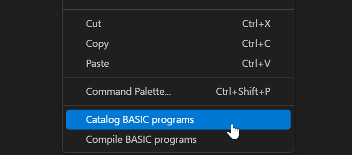

## Catalog Settings in "db.mvbasic.json" file

Please refer to [Configuration](Configuration.md) to open the database related configuration file and then find the "catalog" section.

```
"catalog": {
    "readServerInternal": 5, 
    "isSearchAllDirs": false,
    "programDirs": [
        {
            "fileName": ""
        },
        {
            "account": "",
            "fileName": ""
        }
    ],
    "programMapping": [
        {
            "catalogName": "",
            "program": ""
        },
        {
            "catalogName": "",
            "fileName": "",
            "program": ""
        },
        {
            "catalogName": "",
            "account": "",
            "fileName": "",
            "program": ""
        }
    ]
}
```

- `readServerInternal`: the extension requests catalog related information from server per *X* seconds when connected to a U2 server. *X* is the value you set to this setting. By default *X* is 5 seconds. 
- `isSearchAllDirs`: specifies whether to search all sub-folders to find catalog programs in the current account folder. By default, the value is false, and only the folder containing the file current being edited is searched. If set to true, all sub-folders will be searched.
- `programDirs`: sets the account and folder in which to search for catalog files. You can add multiple items in this setting.
    - `fileName`: file folder name. 
    - `account`: account folder name.
- `programMapping`:
    - `catalogName`: catalog program name; sometimes this is different from the source code file name.
    - `program`: catalog program file name, which is the source code file name.
    - `account`: specifies the account that contains the catalog program file. You can configure multiple account folders in the configuration file. Please refer to [Accounts Settings](Accounts.md) for more details.
    - `fileName`: file folder name.

### Examples

**Example 1**. Search for catalog programs in another source code folder in the current account folder. For example, add a folder named "OtherFolder" to search for catalog programs in current account folder:

    "programDirs": [
        {
            "fileName": "OtherFolder"
        }
    ]

**Example 2**. Search for catalog programs in another account’s folders. For example, add the folder "OtherFolder" (from the “DEMO” account) to search for catalog program files:

    "programDirs": [
        {
            "account": "DEMO",
            "fileName": "OtherFolder"
        }
    ]

**Example 3**. Create a mapping relationship between the names of catalog programs and their source files. For example, to map the catalog program named "CtlgProgram" to the source code file named "SourceCode", the settings should be:

    "programMapping": [
        {
            "catalogName": "CtlgProgram",
            "program": "SourceCode"
        }
    ]

**Example 4**. Create a mapping relationship between the names of catalog programs and their source files, where the source code is in another account folder. For example, to map the catalog program named "CtlgProgram" to the source code file named "SourceCode" (which exists in the “BP” file folder of the "DEMO" account ), the settings should be:

```
"programMapping": [
    {
        "catalogName": "CtlgProgram",
        "file": "BP", 
        "program": "SourceCode"
    }
]
```

**Example 5**. Create a mapping relationship between the names of catalog programs and their source files, where the source code file is in another file folder of the current account. For example, to map the catalog program named "CtlgProgram" to the source code file named "SourceCode" (which exists in the “BP”folder), the settings should be:

```
"programMapping": [
    {
        "catalogName": "CtlgProgram",
        "account": "DEMO"
        "file": "BP", 
        "program": "SourceCode"
    }
]
```

## Quick Catalog

Users can right-click a BASIC program file and select "Catalog" to catalog a single file for both Universe and Unidata databases 



## Catalog Settings in "basic.mvbasic.json" file

Cataloging a program makes it available to all users or to users of one account. You must catalog a program before another BASIC program can call it as an external subroutine.

```
{
    "catalog": "",
    "arguments": "",
    "initialCharacter": "",
    "ud_compile_flavor": ""
}
```

### Cataloging in Universe

**Local Catalog**: Local cataloging creates a VOC entry for the program. This entry is a verb that points to the file and
record containing the object code for the cataloged program. You can access a locally cataloged
program only from the account in which it was cataloged, unless you copy the VOC entry for the
catalog name to another account. Because cataloging a program locally only creates a VOC entry
pointing to the object file, you need not recatalog the program every time you recompile it

    {
        "catalog": "local",
        "arguments": "",
        "initialCharacter": "",
        "ud_compile_flavor": ""
    }

**Normal Catalog**: Normal cataloging copies the specified object record to the system catalog space, making it available
to all users. The name of the program in the catalog is in the following format:
*account*catalog.name
account is the name of the current account directory.
Normal cataloging also creates a VOC entry for the catalog name. This entry is a verb that contains the
name *account*catalog.name in field 2.
Because normal cataloging copies the object code to the system catalog space, you must recatalog
the program every time you recompile it.
To catalog a program normally, specify a catalog.name that does not begin with the characters *, -, $,
or !, and do not specify the keyword LOCAL.

    {
        "catalog": "normal",
        "arguments": "",
        "initialCharacter": "",
        "ud_compile_flavor": ""
    }

**Global Catalog**: Like normal cataloging, global cataloging copies the specified object record to the system catalog
space, making it available to all users. The name of the program in the catalog is in the following
format:
*catalog.name
-catalog.name
$catalog.name
!catalog.name
Global cataloging does not create a VOC entry for the catalog name. The UniVerse command processor
and the run machine look in the system catalog space for verbs or external subroutines with names
that have an initial *, - , $, or ! character. Because globally cataloged subroutines are accessed without
a VOC entry, they are available to all accounts on the system as soon as they are cataloged.
Because global cataloging copies the object code to the system catalog space, you must recatalog the
program every time you recompile it.
To catalog a program globally, specify a catalog.name beginning with *, -, $, or !, and do not specify
the keyword LOCAL.

    {
        "catalog": "global",
        "arguments": "",
        "initialCharacter": "*",
        "ud_compile_flavor": ""
    }

### Cataloging in Unidata

**Direct Catalog**: Catalogs the program locally without copying it to the local or system CTLG directory. Instead, UniData creates an entry in the VOC file that is a pointer to the directory where the program resides.

    {
        "catalog": "direct",
        "arguments": "",
        "initialCharacter": "",
        "ud_compile_flavor": ""
    }

**Local Catalog**: Catalogs the program locally and places a copy of it in a subdirectory of the local CTLG catalog (in the account where the user is running the program). UniData creates a VOC pointer to the subdirectory.UniData creates the CTLG and the subdirectory, if they do not
already exist.

    {
        "catalog": "local",
        "arguments": "",
        "initialCharacter": "",
        "ud_compile_flavor": ""
    }


**Note 1 :** The parameter "arguments" in the basic.mvbasic.json file is currently not supported by the catalog feature. By default, the argument is set to FORCE for both the UV and UD databases.

**Note 2 :** If the `./rmv` configuration exists, the `basic.mvbasic.json` file will be created during the first catalog attempt. If the `./rmv` configuration does not exist, the `config/basic.mvbasic.json` file will be created when the extension is activated.