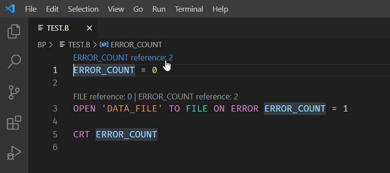

## Code Lens

Code lens allows you to review your code and find references to variables, functions or subroutines without leaving the editor.  To list these references, click the hyperlink as illustrated below. The hyperlink is highlighted when you hover your cursor over the text.

