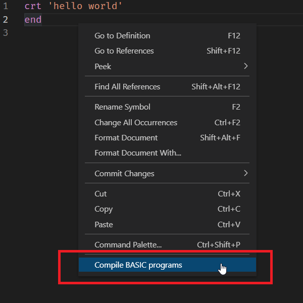
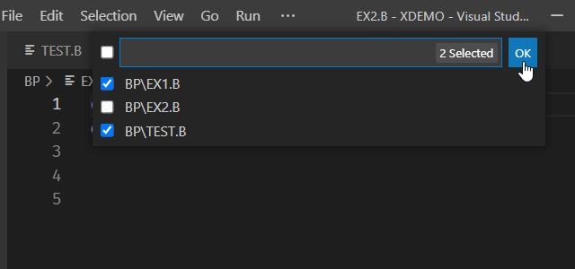
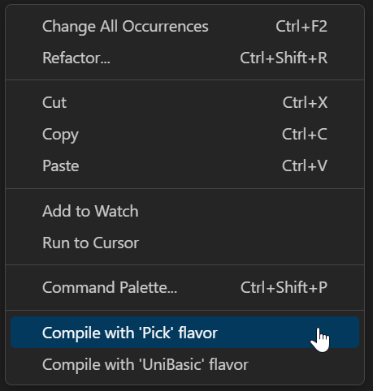
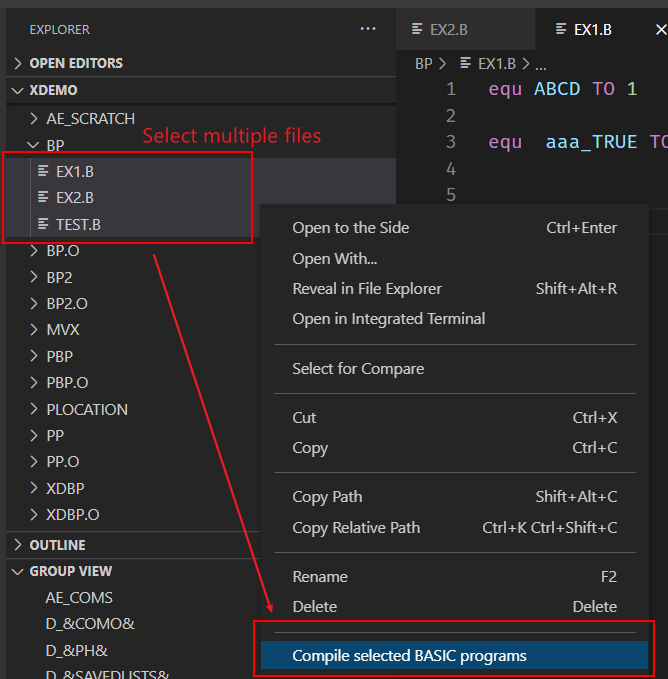
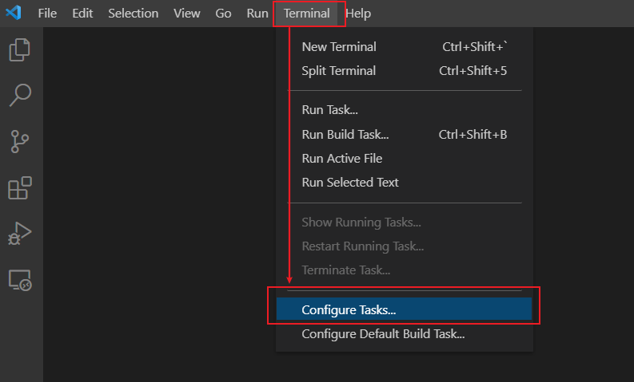
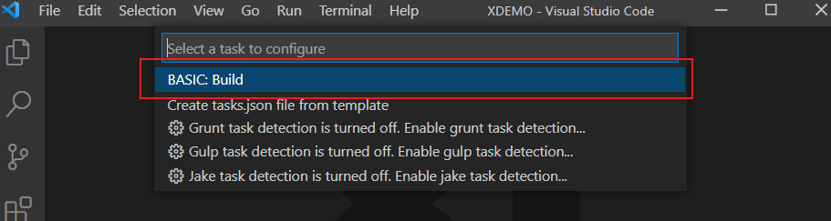
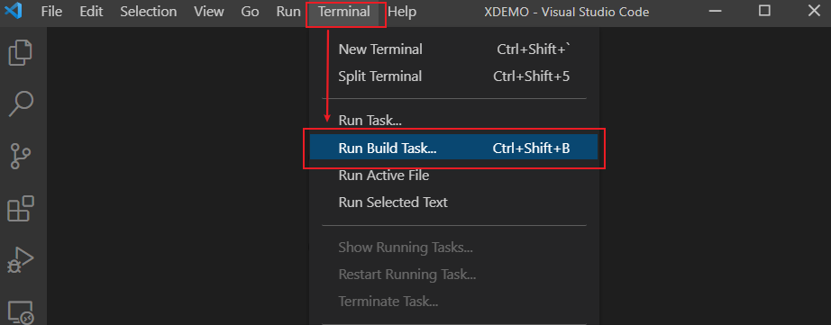

# Compiling BASIC Program Files

Users can compile and catalog BASIC programs using this extension. 

**Note**:

- Before compiling BASIC programs, a U2 server must be connected. For information on connecting to a U2 server, please see [this section](./Connection.md).
- After compiling, regardless of whether the compile succeeds or fails, the BASIC files will be synchronized to the U2 server, overwriting the existing ones and new files will also be created. 
- Generated objective files will not be synchronized from the server to the local machine.
- Compilation does not work properly when VS Code and the extension installed on Linux platform.

## Compile and catalog

There are 3 methods for compiling BASIC program files:

### From editor context

Right-click in the file you want to compile then select "Compile BASIC programs".



If there are no other modified files in your project, the compile process will be started immediately.

If other modified files exist, a list of modified files will display. Select files you want to compile, and then click "OK".



The compilation result will display in the VS Code terminal.

**Note**: Using this method, compiled programs will not be cataloged.

For UniData, different flavors are supported. You can select “Pick” flavor or “UniData” flavor when using right-click compile:



### From a file explorer

Select one or more files, then right click the file(s) and select "Compile selected BASIC programs".



The compilation result will display in the VS Code terminal.

**Note**: Using this method, compiled programs will not be cataloged.

### Through VS Code task

By using VS Code task, users can compile or catalog multiple BASIC programs at the same time.

#### Create a BASIC build task

Select "Configure Default Build Task ..." or "Configure Tasks ..." from the "Terminal" menu to open the Command Palette.



Select "BASIC: build" to create a BASIC build task.



A default build task configuration will be created and displayed in the editor.

```json
{
	"version": "2.0.0",
	"tasks": [
		{
			"type": "BASIC",
			"targets": [],
			"compile": {
				"dataSource": "UNIVERSE", 
				"arguments": ""
			},
			"problemMatcher": [],
			"label": "BASIC: Build", 
            "group": {
                "kind": "build", 
                "isDefault": true
            }
		}
	]
}
```

If the project already has a build task, please see **Example 4** (UniVerse) or **Example 3** (UniData) for instructions on how to add a new build task.

#### Task properties

You can find task properties in the [VS Code official documents](https://code.visualstudio.com/docs/editor/tasks#_custom-tasks). There are also some BASIC compilation specified properties:

- **type**: must be set to "BASIC". This is used to identify that the current task is a BASIC build task.
- **targets**: a list that contains the files you want to compile. The value should be the file's relative path. Please see the examples section for more details.
- **compile**: compilation related settings. It contains following configurable items.
  - **dataSource**: Must be "UNIVERSE" or "UNIDATA", depending on the connected U2 server.
  - **language**: (For UniData only) The programming language flavor. Must be "UniBasic" or "Pick". If not set, "UniBasic" is the default.
  - **catalog**: For UniVerse, you can select "global", "local" or "normal". For UniData, you can select "global", "local" or "direct". If not set, files will not be cataloged.
  - **initialCharacter**: (For UniVerse only) The initial character of the cataloged program can only be set when the **catalog** parameter is set to “global”.
  - **arguments**: Put additional compilation arguments here. For more details, please refer UniVerse / UniData user manual for more details. By default, this setting doesn’t appear in the configuration file. Please add it manually if needed.
#### Run build task

Select "Run build task" from the "Terminal" menu to start the build task.

**Note**: Ensure that a U2 server has been connected. Otherwise, an error will occur.




## UniVerse Compile Task Examples

**Example 1**. Compile a single BASIC program without cataloging. 

```json
{
	"version": "2.0.0",
	"tasks": [
		{
			"type": "BASIC",
			"targets": [
				"BP/SAMPLE_FILE"
			],
			"compile": {
				"dataSource":"UNIVERSE"
			},
			"problemMatcher": [],
			"label": "BASIC: Build",
			"group": {
				"kind": "build",
				"isDefault": true
			}
		}
    ]
}
```

- Add the source code relative path to "targets". In this example, SAMPLE_FILE is in the BP folder.
- "dataSource" must be "UNIVERSE" for UniVerse.
- Don't set "catalog" and "initialCharacter" if you don't catalog programs.


**Example 2**. Compile multiple BASIC program files and perform global cataloging.

```json
{
	"version": "2.0.0",
	"tasks": [
		{
			"type": "BASIC",
			"targets": [
				"BP/SAMPLE_FILE1", 
                "BP/SAMPLE_FILE2", 
                "BP/SAMOLE_FILE3"
			],
			"compile": {
				"dataSource":"UNIVERSE", 
				"catalog": "global", 
                "initialCharacter": "Asterisk mark (*)"
			},
			"problemMatcher": [],
			"label": "BASIC: Build",
			"group": {
				"kind": "build",
				"isDefault": true
			}
		}
    ]
}
```

- You can add multiple source code relative paths to "targets"
- Set "catalog" to "global" if you want to perform global cataloging
- If the "catalog" type is global, you need set "initialCharacter", or the default value "Asterisk mark (*)" will be used


**Example 3**. Compile multiple BASIC program files and perform local cataloging.

```json
{
	"version": "2.0.0",
	"tasks": [
		{
			"type": "BASIC",
			"targets": [
				"BP/SAMPLE_FILE1", 
                "BP/SAMPLE_FILE2", 
                "BP/SAMOLE_FILE3"
			],
			"compile": {
				"dataSource":"UNIVERSE", 
				"catalog": "local"
			},
			"problemMatcher": [],
			"label": "BASIC: Build",
			"group": {
				"kind": "build",
				"isDefault": true
			}
		}
    ]
}
```

- Set "catalog" to "local"(no need to set "initialCharacter")


**Example 4**. Multiple build tasks.

```json
{
	"version": "2.0.0",
	"tasks": [
		{
			"type": "BASIC",
			"targets": [
				"BP/SAMPLE_FILE1"
			],
			"compile": {
				"dataSource":"UNIVERSE"
			},
			"problemMatcher": [],
			"label": "BASIC Build Task 1",
			"group": {
				"kind": "build",
				"isDefault": true
			}
		}, 
        {
            "type": "BASIC",
			"targets": [
                "BP/SAMPLE_FILE2", 
                "BP/SAMOLE_FILE3"
			],
			"compile": {
				"dataSource":"UNIVERSE", 
				"catalog": "global", 
                "initialCharacter": "Asterisk mark (*)"
			},
			"problemMatcher": [],
			"label": "BASIC Build Task 2",
			"group": {
				"kind": "build",
				"isDefault": true
			}
        }
    ]
}
```

- Add another task object in "tasks"
- Change the "label" in the tasks. When you run build tasks, you can select one of these tasks

## UniData Compile Task Examples

**Example 1**. Compile a single BASIC program without cataloging, language flavor is UniBasic.

```json
{
	"version": "2.0.0",
	"tasks": [
		{
			"type": "BASIC",
			"targets": [
				"BP/SAMPLE_FILE"
			],
			"compile": {
				"dataSource":"UNIDATA", 
                "language": "UniBasic"
			},
			"problemMatcher": [],
			"label": "BASIC: Build",
			"group": {
				"kind": "build",
				"isDefault": true
			}
		}
    ]
}
```

- Add source code relative path to "targets". In this example, SAMPLE_FILE is in the BP folder
- "dataSource" must be "UNIDATA" for UniData
- No need to set "catalog" if you don't want to catalog programs
- You can select the language flavor in "language". In this example, the language flavor is "UniBasic"


**Example 2**. Compile multiple BASIC program files and perform global cataloging, language flavor is Pick.

```json
{
	"version": "2.0.0",
	"tasks": [
		{
			"type": "BASIC",
			"targets": [
				"BP/SAMPLE_FILE1", 
                "BP/SAMPLE_FILE2", 
                "BP/SAMOLE_FILE3"
			],
			"compile": {
				"dataSource":"UNIDATA", 
                "language": "Pick", 
                "catalog": "global"
			},
			"problemMatcher": [],
			"label": "BASIC: Build",
			"group": {
				"kind": "build",
				"isDefault": true
			}
		}
    ]
}
```

- You can add multiple source code relative paths to "targets"
- Set "language" to "Pick" flavor
- Set "catalog" to "global" if you want to perform global cataloging


**Example 3**. Multiple tasks

```json
{
	"version": "2.0.0",
	"tasks": [
		{
			"type": "BASIC",
			"targets": [
				"BP/SAMPLE_FILE1"
			],
			"compile": {
				"dataSource":"UNIDATA"
			},
			"problemMatcher": [],
			"label": "BASIC Build Task 1",
			"group": {
				"kind": "build",
				"isDefault": true
			}
		}, 
        {
            "type": "BASIC",
			"targets": [
                "BP/SAMPLE_FILE2", 
                "BP/SAMOLE_FILE3"
			],
			"compile": {
				"dataSource":"UNIDATA", 
                "language": "UniBasic"
				"catalog": "global"
			},
			"problemMatcher": [],
			"label": "BASIC Build Task 2",
			"group": {
				"kind": "build",
				"isDefault": true
			}
        }
    ]
}
```

- Add another task object in "tasks"
- Change "label" in the tasks, When run build tasks, you can select one of these tasks

**Example 4**. Additional compilation arguments

```json
{
	"version": "2.0.0",
	"tasks": [
		{
			"type": "BASIC",
			"targets": [
				"BP/SAMPLE_FILE"
			],
			"compile": {
				"dataSource":"UNIVERSE", 
				"arguments": "-L -X"
			},
			"problemMatcher": [],
			"label": "BASIC: Build",
			"group": {
				"kind": "build",
				"isDefault": true
			}
		}
    ]
}
```

- Compile the BASIC program with arguments "-L" and "-X".