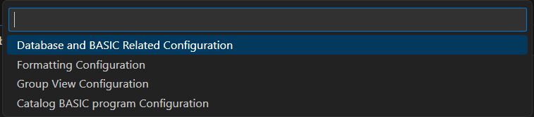
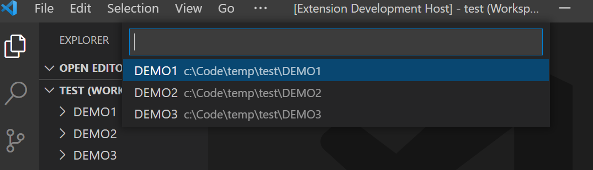

# Configuration

There are many configuration settings for the Rocket MV BASIC extension. These settings are organized into different configuration files.

Press <kbd>F1</kbd> to open the command window and then enter the "*Edit Configuration of Rocket MV BASIC*" command.

There are three configuration files: "Database and BASIC Related Configuration", "Formatting Configuration" and "Group View Configuration".

If there are multiple workspace folders, you can select the folder to edit. Configuration files in different workspace folders have no relationship or dependency. 

## Database and BASIC Related Configuration

The configuration file name is "db.mvbasic.json". 

Following relevant configurations are included:

- U2 server connection. See [U2 connection](./Connection.md) for more information.

 - Additional accounts. See [accounts settings](./Accounts.md) for more information.

 - Catalog programs configuration. See [Catalog Settings in "db.mvbasic.json" file](./Catalog.md) for more information.

 - Include files configuration. See [include settings](./Include.md) for more information.

## Formatting Configuration

The configuration file name is "format.mvbasic.json". 

This configuration file contains the settings for feature Document Formatting. If you need change the formatting settings, please update the settings in this file. See [formatting settings](./Formatting.md) for more information.

## Group View Configuration

The configuration file name is "groupView.mvbasic.json". 

This configuration file contains the settings for feature Group View. If you need change the group view behaviors, please update the settings in this file. See [group view settings](./GroupView.md) for more information.

## Catalog Configuration

The configuration file name is "catalog.mvbasic.json". 

This configuration file contains the parameters for the Catalog feature. If you need to change the catalog type, arguments, or initial character, please update the settings in this file. See [Catalog Settings in "catalog.mvbasic.json" file](./Catalog.md#quick-catalog) for more information.

**Note:** If either `./rmv` or `./rmvonline` configuration exists, the `catalog.mvbasic.json` file will be created during the first catalog attempt. If the `./rmv` configuration does not exist, the `config/catalog.mvbasic.json` file will be created when the extension is activated.

## Configuration Files

There are also user level configuration files in the user profile. When you want to apply some settings to all projects of the current user, you can modify the user-level configuration files.

The user level configuration files are in the the user profile folder. 

For Windows platforms, you can find configuration files in "C:\Users\\*yourusername*\\.rmv\config\".

For Linux platforms, you can find configuration files in "/home/*yourusername*/.rmv/config/".
