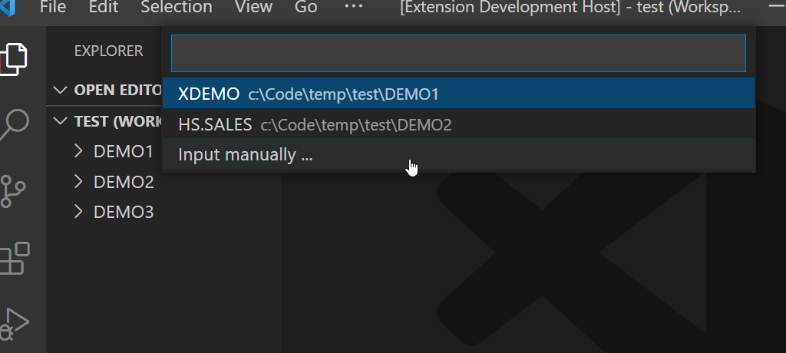
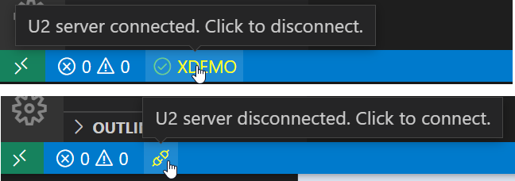

## U2 Connection Settings

The Rocket MV BASIC extension can also connect to a U2 server. Regardless of whether you are connected to a server or not, all editor functions will work as expected. But when connected to a U2 server, some new features will be enabled, and some features will be enhanced:

 - [Goto definition](./Definition.md)
 - [Auto-completion](./Completion.md)
 - [Catalog](./Catalog.md)
 - [Compile BASIC program](./Compile.md)
 - [Debugging BASIC program](./Debugging.md)

### Settings

Please refer to [Configuration](Configuration.md) to open the configuration file.

Following settings are used for U2 connection.

```
 "db": {
  "host": "",
  "userName": "",
  "password": "",
  "account": "",
  "dataSource": "UNIVERSE",
  "port": 31438,
  "rpcName": ""
 },
```

- `host`: host name or address of a U2 server.
- `userName`: user name to login to the U2 server.
- `password`: password to login to the U2 server.
- `account`: account name of a U2 server.
- `dataSource`: `UNIVERSE` or `UNIDATA`, by default is `UNIVERSE`. If open multiple workspace folders and set differnet data source in these folders' configuration files, VS Code will choose the root folder's data source as default.
- `port`: port number of U2 server. For UniVerse and UniData, the port number is `31438` by default.
- `rpcName`: optional. Specifies the name of the remote procedure call (RPC) to be used. Common RPC names for `UNIDATA` and `UNIVERSE` are `udcs` and `uvcs`, respectively, but custom RPC names can be configured as needed.

**Note**: Please enter these settings before connecting to the server.

### Connect to Server

Press <kbd>F1</kbd> to open the command window and then enter the command "Connect/Disconnect U2 Server" to connect to the server.

If some settings are not set in the configuration file, you will need provide these values when prompted in the command window.

If you have multiple workspace folders and have configured multiple U2 accounts, you can select one account from the accounts list or input the account information manually.



Same account level folder could be opened by different workspaces and connected to the U2 server separately.

### Disconnect from Server

Press <kbd>F1</kbd> to open the command window and then enter the Disconnect from MV Server command to disconnect to the server.

### Connection status

The connection status icon is displayed in the bottom-left corner.

Click the icon to connect to or disconnect from the U2 server.

