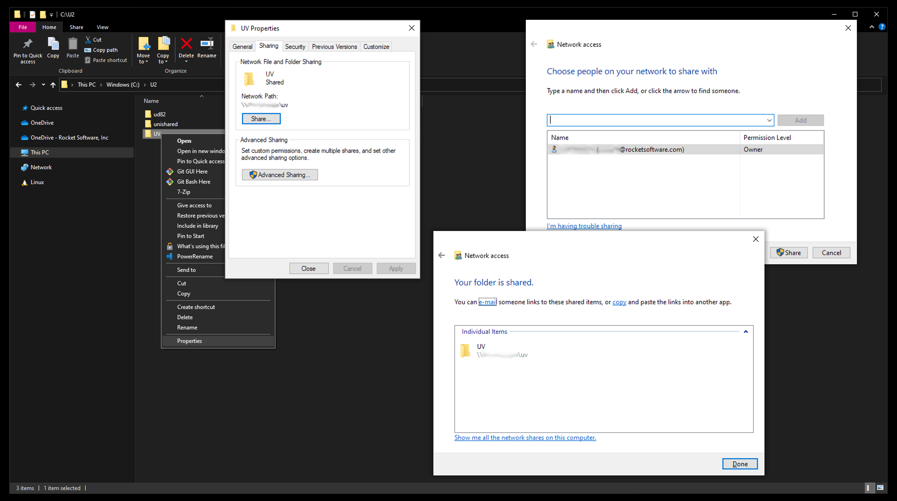

# Create a File Share on U2 server

You can create a File Share of your U2 server to use on your development environment.

## Share U2 Folder on Windows

Ask your system administrator to create a file share on your Windows U2 server. They can follow this process:

1. Open **Windows Explorer** on the U2 server.

2. Browse to the U2 folder, e.g., `C:\U2\`.

3. Right-click the `UV` or `Udt` folder and click **Properties**.

4. Select the **Sharing** tab.

5. Click **Share**.  

    The **Network Access** window opens.

6. Click **Share** and wait for the process to finish.  

    The **Your folder is shared** message will show.

7. Click **Done**.  
    
    This displays the network path needed to map the file share as a network drive.

## Share U2 Directory on Linux

Ask your system administrator to create a SAMBA share of the U2 parent folder, e.g., `/usr/uv/`.

1. Install Samba using your package manager

    **On CentOS**

        sudo yum install samba samba-client

2. Start the service.  

    **On CentOS**

        sudo systemctl start smb.service
        sudo systemctl start nmb.service

3. Enable the service.  

    **On CentOS**

        sudo systemctl enable smb.service
        sudo systemctl enable nmb.service

4. Take note of the U2 directory. E.g., `/usr/uv`.

5. Edit the SAMBA configuration.

        sudo nano /etc/samba/smb.conf

6. Add this configuration block to the bottom of the file. Replace the **path** value to match your U2 directory.

        [u2share]
            path = /usr/uv
            comment = Share U2 folder
            browseable = yes
            read only = no
            force create mode = 0660
            force directory mode = 2770

7. Press <kbd>Ctrl</kbd> + <kbd>0</kbd> to save and <kbd>Ctrl</kbd> + <kbd>X</kbd>  to exit from the nano text editor.

8. Restart the samba server.

        sudo service smbd restart

9. Update your firewall rules to allow samba traffic.

10. Your Samba share also needs a user, as SAMBA does not use system accounts.  
Create a new user, replacing username with a username that exists as a system account.

        sudo smbpasswd -a username

## Map a Share to a Network Drive

To connect to your U2 server shared folder:

1. Open Windows Explorer.

2. Click on **This PC**. 

3. Click on **Map network drive** in the **Computer** tab. 
    
    The **Map Network Drive** window opens.

4. Select a **Drive:** letter.  

    You can choose U: for U2 server.

5. In **Folder:** paste the network path as noted above.

6. Select **Reconnect at sign-in**.

7. When required, select to **Connect using different credentials**.  

8. Click **Finish**.  

    You might be prompted with the **Enter Network Credentials** window.