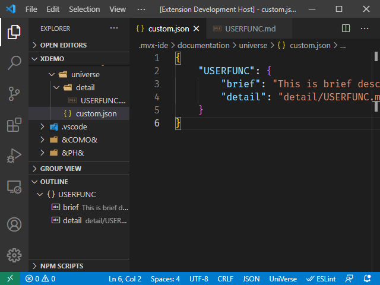
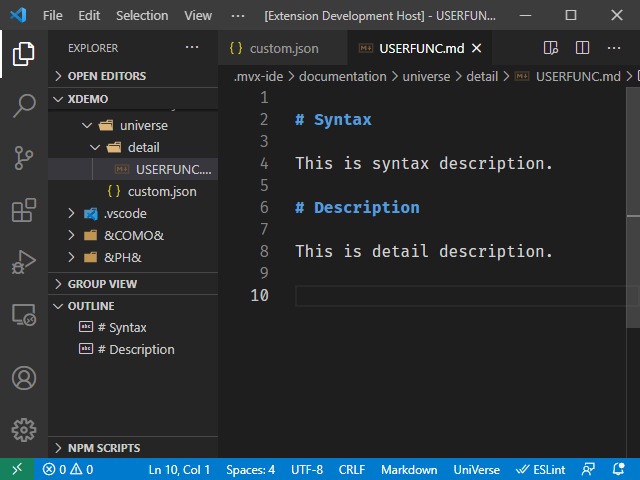

## Customize Documentation Usage

You can provide your own documentation for user-defined functions / subroutines. Complete the steps below to provide your own documentation:
 (These instructions assume you have a user-defined function named *USERFUNC*)

*Step 1*. Activate Rocket MV BASIC extension. 

*Step 2*. Open the documentation configuration file (".rmv/documentation/universe/custom.json" for UniVerse, or ".mvx-ide/documentation/unidata/custom.json" for UniData).

*Step 3*. Add the customized function's content as illustrated below for function USERFUNC.

Add the function / subroutine names in the configuration file and then add its detailed documentation.

- `brief`: Optional. You can add a brief description of customized function in this setting. If the detail setting is not set, this brief description will be displayed when you hover over the customized function / subroutine.

- `detail`: Optional. You can add a relative path that points to a markdown file here. When you hover over the customized function / subroutine, the content in the markdown file will be displayed. 

**Note**: The `brief` item provides a brief description of USERFUNC if the detail setting doesn't exist. If the detail setting exists, the markdown file pointed to by this setting will be used.