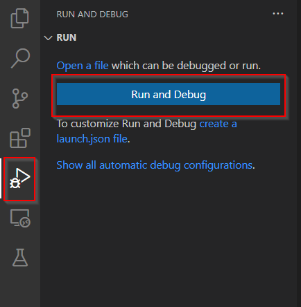
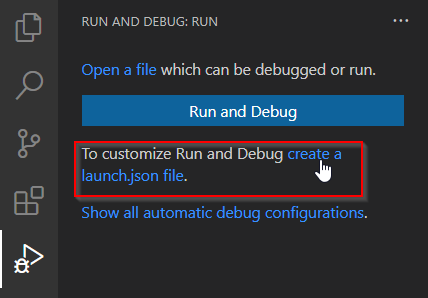
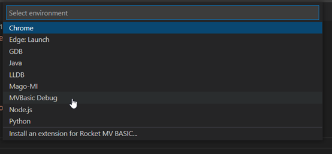
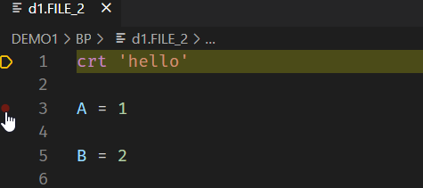
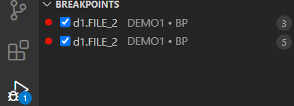
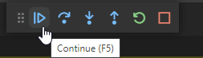
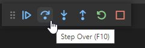
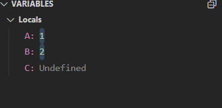
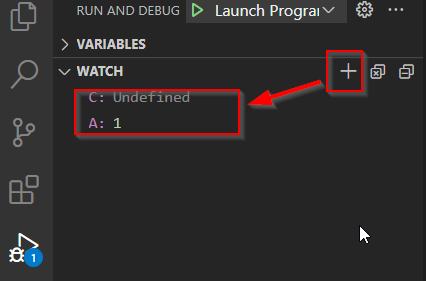
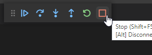

## Debugging (Peview)

With the debugging function, you can easily debug BASIC programs and observe and track the results and changes to variables for each step when running a BASIC program. 

The current version of the debugging function is a preview version and is only supported for UniVerse 11.3.4, 12.1.1 releases(some functions are not yet stable). And debugging also could not work well is there are multiple workspace folders.

Please refer [Known issues](./KnownIssues.md) list to find out existing issues in debugging feature.

### Setup Environment

To support the debugging function, a DAP server will run on the UniVerse server side. In this preview version, you need download the DAP server binaries and add them to UniVerse manually. In future releases, this process will be done automatically.

### Downloading DAP Server

You must login to [RBC](https://rbcint.rocketsoftware.com/) platform to download DAP server binaries. Through below steps to download related binaries:

  1) Click button "Search Product Availability"
  
  2) Select "Product" to "MV BASIC for VS Code", and select "Windows" (binaries for Linux platform are also in this package)
  
  3) In "1.6.0" release, click the "Product" download link

### Installing the DAP server binaries

You need copy the DAP binaries to the U2 server manually. Complete the steps below to configure the environment.

#### Linux Platform

1) Copy **uvdap_server** and **uvdap_slave** to the **$UVHOME/bin** Folder. **$UVHOME** is the installation path for UniVerse.

2) Open the **unishared** folder and find the unirpc services file (unishared/unirpc/unirpcservices). 

3) Open the **unirpcservices** file and add the following new line to unirpcservices:

```
uvdaps <absolute file path of uvdap_server> * TCP/IP 0 3600
```

**Note**: You will need to change to the root user to update this file. 

If you encounter some permission issues during debugging, please try following commands to change these binaries' ownership.

```
chmod 755 uvdap*
chown uvdb uvdap*
chgrp input uvdap*
```

#### Windows Platform

1) Copy the **uvdap_server.exe** and **uvdap_slave.exe** files to the UniVerse bin folder. By default, UniVerse is installed to **"C:\U2\UV"**, and its bin folder is **"C:\U2\UV\bin"**.

2) Open the **unishared** folder and find the unirpc services file named **unirpcservices**. By default, the **unishared** folder installation path is **"C:\U2\unishared"**, and you can find file **unirpcservices** under **"C:\U2\unishared\unirpc"**.

3) Open file **unirpcservices** file and add the following new line to it:

```
uvdaps <absolute file path of uvdap_server> * TCP/IP 0 3600
```

## Start Debugging

### Connecting to a UniVerse account folder

Before using the debugging feature, you must first connect to a UniVerse account folder. Please see the [Connection section](./Connection.md) to learn how to connect to a UniVerse server.

**Note**: The debugging feature only works on **UniVerse** 11.3.4 and 12.1.1 releases in this preview version. The debugging feature will not work if you only open a single BASIC program file in VS Code. You must open an account folder.

### Debugging BASIC files

There are 2 methods to debug a BASIC program file: debugging without a launch file and debugging with a launch file.

Before debugging, the BASIC program file must be compiled first.

### Debugging without a launch file

 - Click the **Run and Debug** icon on left menu bar. The **Run and Debug** view will display if you have no `launch.json` file in your project.

 - Click the **Run and Debug** button to start debugging the currently focused BASIC program file. 



The BASIC program file will be compiled first. If successful, the debugging process will stop at the first runnable line of code in the program file.


### Debug with launch file

You can also configure a `launch.json` file for debugging.

In the **Run and Debug** view, click the create a `launch.json` file link. 



Select the **MVBasic Debug** from the Select environment dialog box.



From the **Run and Debug** view, set the launch option to **Launch Program**. Then press the F5 button to start debugging. 


## Support Operations

The following debug operations are supported.

### Setting break point

When debugging starts, you can set a break point by:

 - Clicking the  head of a line

 - Pressing the F9 key for an in-focus line.



You can find all break points in **BREAKPOINTS** panel of the **Run and Debug** view.



The program will stop when the process encounters a break point.

### Continue

When the process encounters a break point, the program will stop running. You can press the F5 key or click the Continue button from the debug panel to continue running the program. 



### Step over

The step over function allows you to run the program line-by-line. Press the F10 button or click the Step Over button from the debug panel to run one line of the program.



### View variables

When debugging starts, you can view all variables in the **Run and Debug** view.



If variables have no value or have not been initialized, the variable’s value is undefined.

### Watch variables

You can also add variables to the **WATCH** panel.

Click the plus (+)button from the **WATCH** panel and enter the variable nameto display the variable’s value.



### Stop debugging

Click the **Stop** button to stop the debugging process.



### Step in and step over

These two operations are still not stable. They could work when breakpoints are set. Please refer [Known Isseus](./KnownIssues.md).