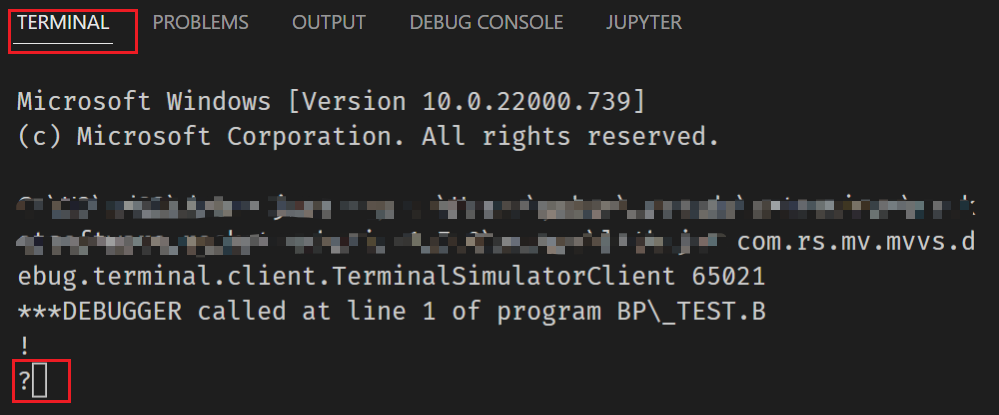

## Debugging

With the debugging function, users can easily debug BASIC programs, as well as observe and track the results and changes to variables for each step when running a BASIC program. 

The following U2 server versions and platforms are supported:

### UniVerse

Versions: 11.3.2 or higher

Platforms: Windows, Linux, AIX

### UniData

Versions: 8.2.4

Platforms: Windows, Linux, AIX

### A high performance debugging feature

Since the 2.2.0 release, a high-performance debugging feature is supported on UniVerse 11.4.1. To use this feature, you must upgrade to UniVerse 11.4.1 or higher version. Please see [Debugging Binaries Releases](./DAPRelease.md) for more details.

## Start Debugging

**Note**: You should not debug BASIC subroutines directly, because this not allowed in UniVerse and UniData.

### Connecting to a U2 server account folder

Before using the debugging feature, you must connect to a U2 server account folder firstly. Please see the [Connection section](./Connection.md) to learn how to connect to a U2 server account.

**Note**: The debugging feature will not work if you only open a single BASIC program file in VS Code. You must open an account folder.

### Debugging BASIC files

There are 2 methods to debug a BASIC program file: debugging without a launch file and debugging with a launch file.

Before debugging, open the BASIC program first.

**Note**: debugging a BASIC subroutine directly is not allowed.

### Debugging without a launch file

 - Click the **Run and Debug** icon on left menu bar. The **Run and Debug** view will display if you have no `launch.json` file in your project.

 - Click the **Run and Debug** button to start debugging the currently focused BASIC program file. 


The BASIC program file will be compiled first. If successful, the debugging process will stop at the first runnable line of code in the program file.

### Debug with launch file

You can also configure a `launch.json` file for debugging.

In the **Run and Debug** view, click the create a `launch.json` file link. 


Select the **MVBasic Debug** from the Select environment dialog box.


Then a default debugging configuration file launch.json will be generated in directory .vscode.

```
{
    "version": "0.2.0",
    "configurations": [
        {
            "type": "mvbasic",
            "request": "launch",
            "name": "Launch Program",
            "program": "",
            "stopOnEntry": true,
            "preLaunchTask": "BASIC: Build",
            "dependencies": [], 
            "arguments": ""
        }
    ]
}
```

 - "type": "mvbasic" is required to build BASIC program files.
 - "request": keep this value "launch" to launch a program.
 - "name": this is the name of the launch task. You can change the name to other values.
 - "program": if this value is empty, current focused file will be debugged. You can also set this value to another BASIC program file's absolute path. This file will be compiled before debugging.
 - "stopOnEntry": used to control whether the program will be stopped at the first runnable line when start debugging. Currently only true is supported.
 - "preLaunchTask": this is used to run pre-required task before debugging. In our extension, we use this setting to compile the BASIC program in setting "program" first.
 - "dependencies": put other BASIC program files' absolute paths here if they need to be compiled before debugging. For example, "C:\U2\UV\XDEMO\TEST". 
 - "arguments": put additional debugging online· here. Please refer to your UniVerse / UniData user documentation for more details. By default, this setting doesn’t appear in the configuration file, but can be added manually if needed.

From the **Run and Debug** view, set the launch option to **Launch Program**. Then press the F5 button to start debugging. 


## Support Operations

The following debug operations are supported.

### Setting break point

When debugging starts, you can set a break point by:

 - Clicking the  head of a line

 - Pressing the F9 key for an in-focus line.


You can find all break points in **BREAKPOINTS** panel of the **Run and Debug** view.


The program will stop when the process encounters a break point.

**Note**: Condition breakpoints are not supported.

### Continue

When the process encounters a break point, the program will stop running. You can press the F5 key or click the Continue button from the debug panel to continue running the program. 

**Note**: Program cannot jump out of a subroutine through this operation in UniVerse.


### Step over

The step over function allows you to run the program line-by-line. Press the F10 button or click the Step Over button from the debug panel to run one line of the program.

**Note**: Program cannot jump out of a subroutine through this operation in UniVerse.


### Step into and step out

These two operations are still not stable. They partially work if breakpoints are set at CALL line. Please refer [Known Issues](./KnownIssues.md).

**Note**: Program cannot jump out of a subroutine through **Step Out** operation in UniVerse.

## Restart debug

Click **restart** button to restart debugging process.

### Stop debugging

Click the **Stop** button to stop the debugging process.


### View variables

When debugging starts, you can view all variables in the **Run and Debug** view. 

You can also change a variable's value by double-clicking it in the **Run and Debug** view (this only works on UniVerse 11.4.1).


If variables have no value or have not been initialized, the variable’s value is undefined.

### Watch variables

You can also add variables to the **WATCH** panel.

Click the plus (+) button from the **WATCH** panel and enter the variable name to display the variable’s value.


**Note**: Only variables are supported. Expressions are not supported.

### Handle input operation

You can switch to the VS Code terminal to handle an INPUT statement during BASIC program running. 


