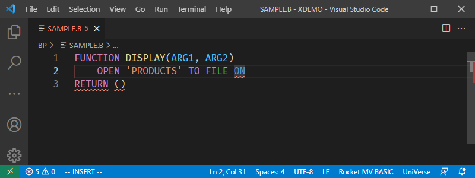
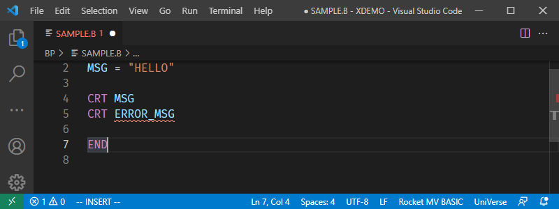

# Diagnostics

Diagnostics can help users find syntax and grammar errors while in the process of writing BASIC programs. A BASIC statement that contains an error is indicated with a red underscore.

Diagnostics will also point out any variables that have been referenced before they have been defined.

