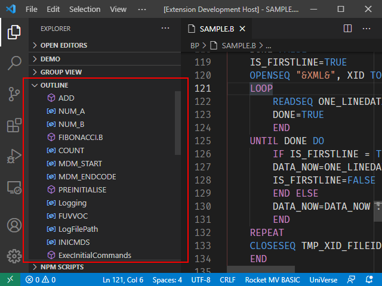
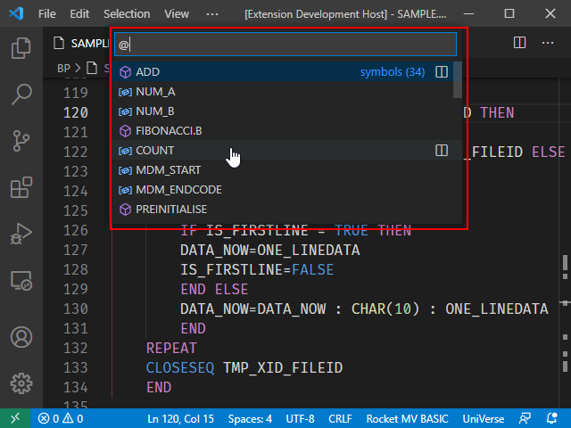

## Using Document Symbols

Open a BASIC program file to view all the symbols in the current document in VS Code outline window.

If you click a symbol in the outline window, the cursor will indicate its location.

You can also use a command to find a symbol. Press <kbd>Ctrl</kbd> + <kbd>P</kbd> to open the search window and then enter <kbd>@</kbd> to list all symbols in current document.

Type the first few characters of a symbol in the command window to filter the results, and then click the corresponding symbol to jump to its definition location.