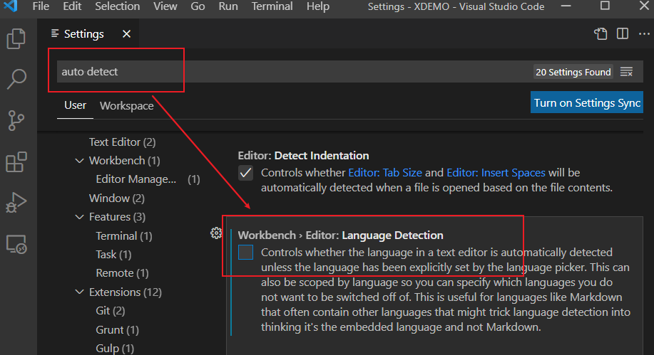
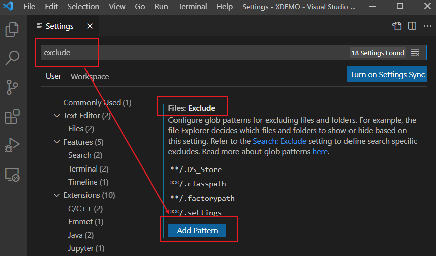

# FAQ

**Q: How do I activate the extension automatically?**

**A:** By default, when open a file ends with a ".B" suffix, the extension could be activated automatically. If your files don't have such suffix, you can setup file associations to activate the extension. 

Press <kbd>F1</kbd> to open a command line in VS Code, then enter "*Open Settings (UI)*" to open the settings page.

   	
   
Search "*associations*" in the Settings page and find the setting "*Files: Associations*". Add an item in this setting (the item content accepts a [glob pattern](https://en.wikipedia.org/wiki/Glob_(programming))).

The item in the example image above specifies that the Rocket MV BASIC extension will be activated when any file in the BP folder is opened. 

**Q: I have set the files association, but when I open a BASIC program file, the language changed.**

**A:** This is a new feature named "Auto Detect Language" of VS Code (since the 1.60 release). It auto detects and sets the language of your files even when you have already set files associations. You can disable this feature following the steps below:

1. Open VS Code Settings: press F1, input "setting", then select "Open Settings (UI)"
2. Search for "auto detect", and then find and disable the "Language Detection" setting.

   

**Q: How can I exclude specific files from a folder? For example, files start with "_".**

**A:** VS Code provides a function to exclude useless files. Follow the steps below to exclude files:

1. Open VS Code Settings: press F1, input "setting", then select "Open Settings (UI)"

2. Search for "exclude", and then find the setting "Files: Exclude"

    

3. Click "Add Pattern", and then enter a pattern that exists in the file names you want to exclude.