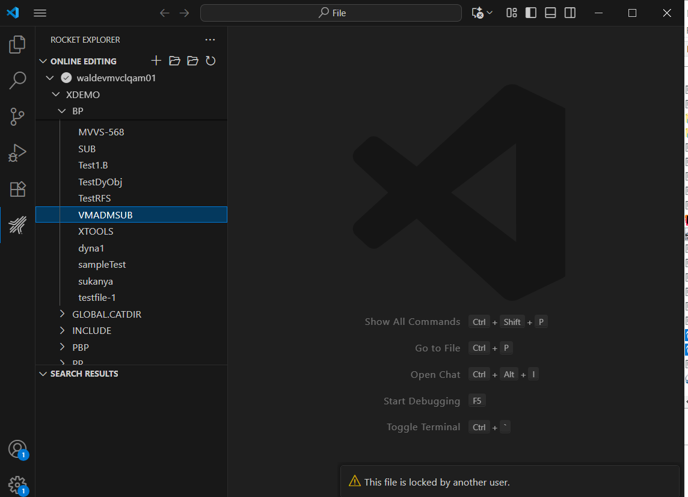
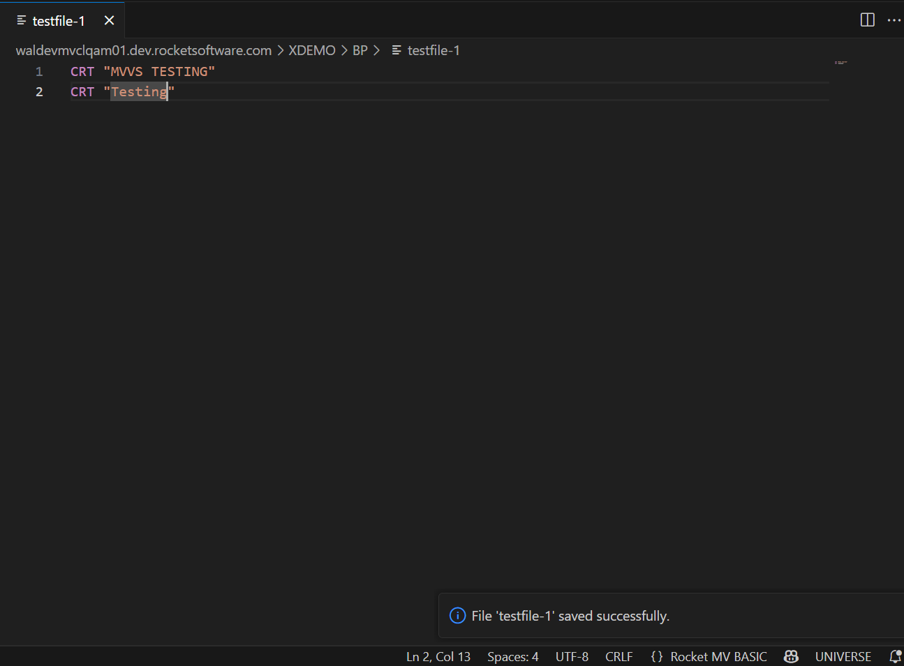

## File Locking in Online Editing

This section explains how the MVVS Online Editing feature handles file locking when working with BASIC program files on a UniVerse or UniData (U2) server.

Two general strategies exist for concurrency control: pessimistic locking and optimistic locking.
<!--The first sentence refers to file locking, but now concurrency control is introduced here. -->

The default mode is now **Optimistic Locking**. In this mode no continuous server lock is held; instead, the extension performs a lock/conflict check when a file is first opened and again each time it is saved. Lightweight validation might also occur during certain edit or focus events. 

Optionally, a full exclusive and continuous pessimistic locking mode is available and can be enabled per project via the `basic.mvbasic.json` setting `file_lock_state`.

---
### Concepts Overview

| Term | Description |
|------|-------------|
| Optimistic phase | The period you are editing locally without holding a server lock during which conflicts are assumed to be rare. |
| Optimistic check | A verification step performed when you open a file and before a file save, and potentially a per-edit event, to ensure the file is not exclusively locked elsewhere. |
| Pessimistic (exclusive) lock | A continuous lock retained for the full edit session to prevent others from opening the file. |
| file_lock_state | Configuration flag (`ON`/`OFF`) in `basic.mvbasic.json` that enables (ON) continuous exclusive locking or (OFF) keeps default optimistic locking. |

---
### Configuring Exclusive (Continuous) Locking
You can switch between the default optimistic mode and the pessimistic exclusive lock mode.

Steps:
1. Open the `basic.mvbasic.json` file in your online editing project.
2. Add or modify the property:
   ```json
   {
     "file_lock_state": "ON"  // or "OFF" (default optimistic)
   }
   ```
3. Save the configuration file.
4. Reopen the BASIC program file for the setting to take effect.

Meaning:
- `ON`: Enables **pessimistic exclusive locking**. When a BASIC file is opened, an exclusive lock is held for the entire edit session. Other users attempting to open the same file receive a message: `This file is locked by another user.`
- `OFF` (default / if omitted): Enables **optimistic locking**. Multiple users can open the same file.

---
### Pessimistic (Exclusive) Locking (file_lock_state = ON)
Pessimistic locking assumes conflicts are likely. A lock is acquired when the file is opened and retained for the full editing session until the editor is closed or the file is otherwise released. This prevents others from opening the file.

Continuous locks can:
- Block other developers for long periods.
- Increase the risk of stale locks if the editor crashes. In this case, the extension attempts cleanup, but external factors can interfere.

**When File is Already Locked:**
If another user already has the file open with an exclusive lock, any subsequent user attempting to open the same file will see the following message:

**Message:**
```
This file is locked by another user.
```


The file open operation will be aborted, and the file will not open in the editor.

---
### Optimistic Locking (Default, file_lock_state = OFF)
In optimistic mode you edit a local copy without holding a server lock. The extension:
- Acquires a short READ/validation lock/check when opening.
- Releases it immediately after obtaining a clean copy.
- Performs a conflict/lock check before saving (and may perform lightweight checks when an edit is made or when regaining focus) to ensure no exclusive lock is currently held elsewhere.

Advantages:
- Minimizes lock contention.
- Improves scalability with many users.
- Reduces risk of lingering locks after network issues.

Risk:
- Another user or external process could modify the server copy between your open and save. Your save then overwrites their changes (last-writer-wins) without merge.

Currently MVVS does **not** perform an automatic diff/merge or modification timestamp comparison before overwrite.

---
### Save Workflow (Step-by-Step)
Optimistic Mode (`file_lock_state` = OFF):
1. the user triggers Save in VS Code.
2. The extension performs an optimistic conflict/lock check, and attempts a short WRITE or validation lock.
3. If the acquisition/check fails, a warning displays and the save is aborted. The remote file stays unchanged.
4. If the check succeeds, a local copy is uploaded and the remote content is replaced.
5. Any temporary lock is released immediately.

Exclusive Mode (`file_lock_state` = ON):
1. The file already has an exclusive lock from open.
2. the user triggers Save and the write proceeds directly while the existing lock guarantees exclusivity.
3. The lock is released when the editor/file is closed or project is unloaded.

---
### Best Practices for Teams
- Use `file_lock_state = ON` for highly critical or frequently contended programs where overwrites are unacceptable.
- Use the default optimistic mode for general development to keep collaboration fluid.
- Communicate when editing critical programs to avoid surprise overwrites (optimistic) or prolonged locks (exclusive).
- Save frequently in optimistic mode to reduce the conflict window.
- Consider exporting to version control for complex collaborative changes.

---
### File Modified on Server
When the same file on the same server is edited by another user, the system will notify you with the following message:

**Message:**
```
The file "fileName" in "dirName" has been modified by another user on the server.
Click Okay to overwrite the file.
```


**User Actions & Outcomes:**

**Click Overwrite (Okay):**
- The file will be overwritten on the server, and you will see a confirmation message:
  ```
  File saved successfully
  ```
  

**Click Cancel:**
- The overwrite is canceled, and your local changes are kept.

**Close the File Without Overwriting:**
- You will be prompted whether to save the file or close it without saving.
