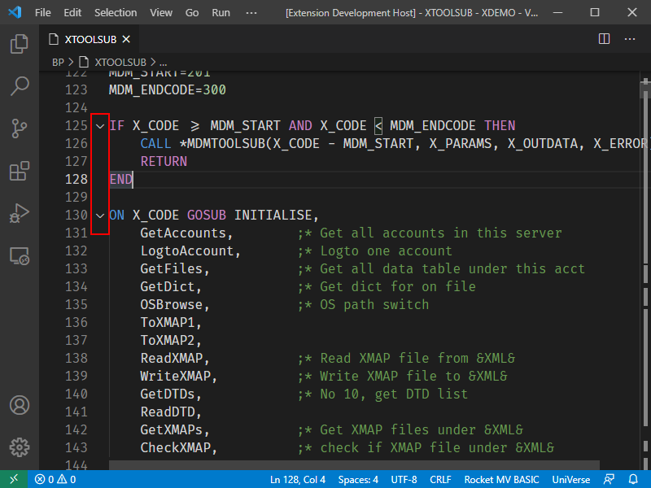
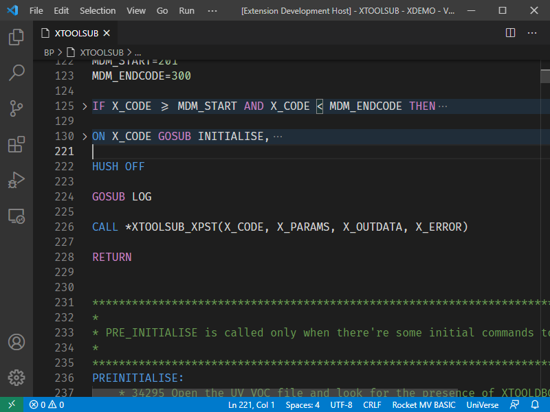

## Code Folding

The code folding feature can be used to improve code readability for statements containing large blocks of code.

The following code snippet contains code blocks for the IF statement and the ON statement.

By clicking on the code folding icon, large code blocks are folded according to the syntax of the current statement.

