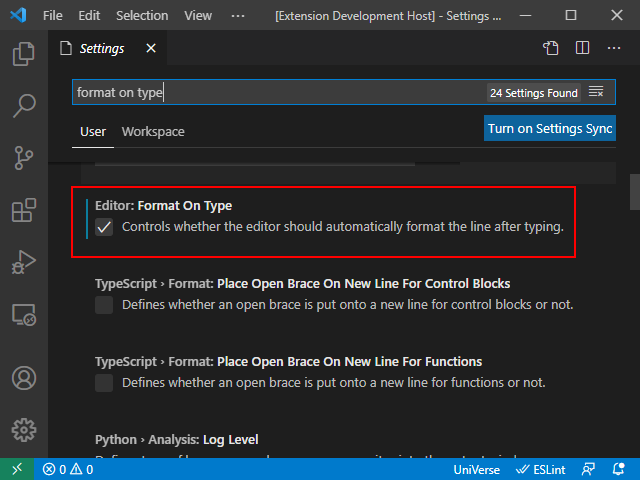

## Formatting Usage

There are three ways to format a document:

- Document formatting: press <kbd>F1</kbd> to open a command window and then enter "Format Document" to format the entire document.
- Range formatting: select a part of the code and then right-click the box and select "Format Selection" to format your selection.
- On typing formatting: open the VS Code settings page and search for "format on type". Select the `Editor: Format On Type` option. When this option is selected, the line of code you just finished editing will be formatted automatically after pressing <kbd>Enter</kbd>.



The formatting related configuration file contains many formatting settings. The information below describes these settings:

### trimNewlines

Trim the original multiple newlines to keep one blank line.

**Note:** Not applicable for *On Type Formatting.*

#### Type and Values

- boolean 

#### Example

Before:

```
CRT “HELLO”
CRT “WORLD”


CRT “HI”
```

After:

```
CRT “HELLO”
CRT “WORLD”

CRT “HI”
```


### trimFinalNewlines

Trim the final newlines down to one newline.  

**Note:** This option is dependent upon Visual Studio Code and will be subject to the Visual Studio Code’s setting in future releases.

**Note:** Not applicable for *On Type Formatting.*

#### Type and Values

- boolean

#### Example

Before:

```
CRT “HELLO”
END


</EOF>
```

After:

```
CRT “HELLO”
END

</EOF>
```


### trimTrailingWhitespace

Trim the trailing white spaces of a line.

#### Type and Values

- boolean

#### Example

Before:

```
CRT “HELLO”</SPACE></SPACE></SPACE>
```

After:

```
CRT “HELLO”
```


### insertFinalNewline

Insert a newline at the end of the file if one does not exist.

**Note:** Not applicable for *On Type Formatting.*

#### Type and Values

- boolean

#### Example

Before:

```
CRT “HELLO”</EOF>
```

After:

```
CRT “HELLO”
</EOF>
```


### multiStatementsOneLine

Specify whether to allow multiple statements on the same line.

**Note:** this option will not take effect for line clauses when *clause.useBlock* is *false*. To split statements in a line clause, set *clause.useBlock* to *true*.

**Note:** Not applicable for *On Type Formatting.*

#### Type and Values

- boolean

#### Example 1

When *clause.useBlock* is set to *false*.

Before:

```
CRT “HELLO”; CRT “WORLD”
IF CLAUSE.USEBLOCK = FALSE THEN CRT “HI”; CRT “WORLD”
```

After:

```
CRT “HELLO”
CRT “WORLD”
IF CLAUSE.USEBLOCK = FALSE THEN CRT “HI”; CRT “WORLD”
```

#### Example 2

When *clause.useBlock* is set to *true*.

Before:

```
CRT “HELLO”; CRT “WORLD”
IF CLAUSE.USEBLOCK = TRUE THEN CRT “HI”; CRT “WORLD”
```

After:

```
CRT “HELLO”
CRT “WORLD”
IF CLAUSE.USEBLOCK = TRUE THEN 
    CRT “HI”
    CRT “WORLD”
END
```


### alignInlineComments

Specify the column to which the inline comments are aligned when possible.

#### Type and Values

- integer

#### Example

If it is set to *30*,

Before:

```
CRT “HELLO” ;* HELLO
CRT “WORLD”            ;* WORLD
CRT “!!”           ;* !!
```

After:

```
CRT “HELLO”         ;* HELLO
CRT “WORLD”         ;* WORLD
CRT “!!”            ;* !!
```


### spacing.operator

Specify the number of whitespaces around binary operators such as “+”, ”-“, ”:”, etc.

#### Type and Values

- integer

#### Example

If it is set to *1*,

Before:

```
A = B+C
A = B-C
A = B:C
```

After:

```
A = B + C
A = B – C
A = B : C
```


### spacing.assignment

Specify the number of whitespaces around assignment symbols such as “=”, “+=”, “:=”, etc

#### Type and Values

- integer

#### Example

If it is set to *1*,

Before:

```
A=B
A+=B
A:=B
```

After:

```
A = B
A += B
A := B
```


### spacing.semicolon

Specify the number of whitespaces after a semicolon delimiter between statements on the same line.

#### Type and Values

- integer

#### Example

If it is set to *1*,

Before:

```
CRT “HELLO”;CRT “WORLD”
```

After:

```
CRT “HELLO”; CRT “WORLD”
```


### spacing.comma

Specify the number of whitespaces after a comma delimiter in a parameter list.

#### Type and Values

- integer

#### Example

If it is set to *1*,

Before:

```
CALL SAY(HELLO,WORLD)
```

After:

```
CALL SAY(HELLO, WORLD)
```


### spacing.parentheses

Specify the number of whitespaces after the open parentheses and before the close parentheses for a parameter list or matrix reference.

#### Type and Values

- integer

#### Example

If it is set to *1*,

Before:

```
CALL SAY(HELLO, WORLD)
```

After:

```
CALL SAY( HELLO, WORLD )
```


### spacing.squareBrackets

Specify the number of whitespaces after the open square bracket and before the close square bracket for a parameter list or matrix reference.

#### Type and Values

- integer

#### Example

If it is set to *1*,

Before:

```
CALL SAY(HELLO, WORLD)
```

After:

```
CALL SAY( HELLO, WORLD )
```


### spacing.angleBrackets

Specify the number of whitespaces after the open angle bracket and before the close angle bracket for dynamic arrays.

#### Type and Values

- integer

#### Example

If it is set to *1*,

Before:

```
VALUE = DYNARRAY<1, 2>
```

After:

```
VALUE = DYNARRAY< 1, 2 >
```


### style.operator

Specify whether to use a symbol or keyword for operators such as *GT*, *LE*.

#### Type and Values

- string

    - “*Symbol*”: use symbols such as >, <, #
    - “*keyword*”: use keywords such as *LT*, *GT*, *NE*
    - “*keep*”: keep the original form.

#### Example

If it is set to “*keyword*”,

Before:

```
IF A > B THEN CRT “HELLO WORLD”
```

After:

```
IF A GT B THEN CRT “HELLO WORLD”
```


### style.keyword

Specify whether to use the full name or abbreviated name for keywords that support abbreviation.

#### Type and Values

- string
    - “*full*”: use full name such as *EQUATE*.
    - “*abbr*”: use keyword such as *EQU*.
    - “*keep*”: keep the original form.


#### Example

If it is set to “*abbr*”,

Before:

```
EQUATE HELLO LITERALLY “HI”
```

After:

```
EQU HELLO LIT “HI”
```


### style.commentMark

Specify the style of comment mark.

#### Type and Values

- string

    - “*rem*”: use *rem* for as comment mark.

    - “*”: use * as comment mark.

    - “!”: use ! as comment mark.

    - “$*”: use $* as comment mark.


#### Example

If it is set to “*rem*”,

Before:

```
* comment line
A = B ;* inline comment
```

After:

```
REM comment line
A = B ;REM inline comment
```


### style.keywordCase

Specify the case for the keywords.

#### Type and Values

- string

    - “*uppercase*”: Use upper case for keywords like *IF*

    - “*lowercase*”: use lower case for keywords such as *if*.

    - “*titlecase*”: use title case for keywords such as *If*.

    - “*keep*”: keep the original form.


#### Example

If it is set to *lowercase*,

Before:

```
IF A = B THEN
     CRT “Hello World”
END
```

After:

```
if A = B then
    crt “Hello World”
end
```


### indent.base

Specify the number of TAB’s to use as the base indentation for all statements except: 

- Labels

- Directives (see *indent.directive*)  

- *PROGRAM*, *SUBROUTINE*, *FUNCTION* Statements

- *END* statements (not for block end)

- Comment (see *indent.commentLine*)


#### Type and Values

- integer


#### Example

With *indent.base* set to 1 and in Visual Studio Code, *tabSize* is set to 4,

Before:

```
SUBROUTINE GREETING(HI, NAME)
CRT HI
CRT NAME
WELCOME:
CRT “WELCOME”
END
```

After:

```
SUBROUTINE GREETING(HI, NAME)
    CRT HI
    CRT NAME
WELCOME:
    CRT “WELCOME”
END
```


### indent.block

Specify whether to indent statements in block clauses. The spaces for each level of indentation is configured by the *tabSize* in the Visual Studio Code.

#### Types and Values

- boolean


#### Example

If it is set to *true*,

Before:

```
IF A = B THEN
CRT “HELLO”
CRT “WORLD”
END
```

After:

```
IF A = B THEN
    CRT “HELLO”
    CRT “WORLD”
END
```


### indent.commentLine

Whether to indent comment lines as statements. If set to *true*, the comment line will be indented the same as the statement following the comment.

#### Type and Values

- boolean


#### Example

If it is set to *true*,

Before:
```
* COMMENT LINE 1
IF A THEN 
* COMMENT LINE 2
    CRT “HI WORLD”
END
```

After:
```
* COMMENT LINE 1
IF A THEN 
    * COMMENT LINE 2
    CRT “HI WORLD”
END
```


### indent.directive

Specify whether to indent the directives as statements.

#### Type and Values

- boolean


#### Example

If it is set to *true*,

Before:

```
$INCLUDE INC GREETING.H
    CRT ‘HELLO’
```

After:

```
    $INCLUDE INC GREETING.H
    CRT ‘HELLO’
```


### indent.clause

If a clause is starting at a new line, then this option controls whether to indent whole clause (including the clause keyword).

#### Type and Values

- boolean


#### Example

If it is set to *true*,

Before:

```
OPEN FILENAME TO FILEVAR 
ON ERROR
    CRT “ERROR”
END
THEN
    CRT “GOOD”
END
ELSE
    CRT “BAD”
END
```

After:

```
OPEN FILENAME TO FILEVAR 
    ON ERROR
        CRT “ERROR”
    END
    THEN
        CRT “GOOD”
    END
    ELSE
        CRT “BAD”
  END
```


### clause.useBlock

Specify to always use a block for clauses,

**Note:** Not applicable for *On Type Formatting.*

#### Type and Values

- boolean


#### Example

If it is set to *true*,

Before:

```
IF A = B THEN CRT “HI”; CRT “ WORLD”;
```

After:

```
IF A = B THEN
    CRT “HI”; CRT “ WORLD”
END
```


### clause.addBlankLines

For block clauses, always add a blank line before and after the block.

**Note:** Not applicable for *On Type Formatting*

#### Type and Values

- boolean


#### Example

If it is set to *true*,

Before:

```
IF A = B THEN
    CRT “HI”
    CRT “ WORLD”
END
```

After:

```
IF A = B THEN

    CRT “HI”
    CRT “ WORLD”

END
```


### clause.atNewline

Specify to always ensure that clause keywords (*THEN/ELSE/LOCKED/ON ERROR*) start at a new line.

**Note:** Not applicable for *On Type Formatting.*

#### Type and Values

- boolean


#### Example

If it is set to *true*,

Before:

```
IF A = B THEN
    CRT “HI”
    CRT “WORLD”
END
```

After:

```
IF A = B 
THEN
    CRT “HI”
    CRT “WORLD”
END
```


### routine.labelPattern

Specify a pattern for labels. A Statement’s indentation under these labels is the same as subroutines. For other statements, the indentation is the same as the main routine.

**Note**: If this value is left empty, all statements under the labels use the same indentation as subroutines except for the first label.

#### Type and Values

- string


The pattern follows GLOB rule.

#### Example

If set to *LABEL**, 

Before:

```
MAIN:
    NULL
    RETURN

LABEL1:
    NULL
    RETURN

LABEL2:
    NULL
    RETURN

FINAL:
    NULL
    RETURN
```

After:

```
MAIN:
NULL
RETURN

LABEL1:
    NULL
    RETURN

LABEL2:
    NULL
    RETURN

FINAL:
NULL
RETURN
```

 