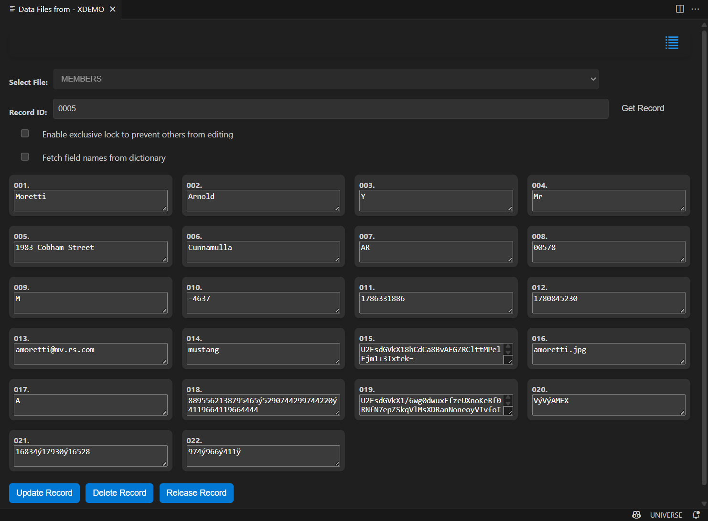

# Hashed File Editing (Online Mode)

This user guide provides instructions on how to use the **Hashed File Editing** feature to manage and edit records in a selected file. This feature allows users to view, edit, update, and delete records through a user-friendly interface.

**Note:** This feature is enabled for both UniVerse and UniData, but currently works with UniVerse only.

## Getting Started

To start using the Hashed File Editing interface:

1. Connect to the U2 server.
2. Right-click on the account.
3. Click on "Show Data Files" to open the Hashed File Editing interface.

---

## Navigating the Interface

The interface is organized into several sections designed to help you manage and edit records efficiently.

### File Selection

The **File Selection** dropdown allows you to choose the file from which you want to view and manage records.

- **Select File:** Choose a file from the dropdown list
- **Files Available:** The extension automatically populates the list of available files from the U2 server.

### Record ID Input

Use the **Record ID Input** field to specify the ID of the record you want to view or edit.

- **Record ID Field:** Enter the record ID in the input box
- **Get Record Button:** Click this button to fetch the corresponding record from the selected file

### Checkbox Options

Two checkboxes provide additional functionality:

1. **Enable Exclusive Lock:** Check this box to lock the record for editing, preventing others from making changes while you are working on it.
2. **Fetch Field Names from Dictionary:** Check this to retrieve field names from the dictionary.

### Fields Display

Once a record is loaded, its fields are displayed dynamically in the **Fields Display** section.

- Each field is shown with its name and value.
- Fields are editable, allowing you to modify values as needed.

If the record is locked by another user, the fields will be displayed as **read-only**.

### Toggle Layout

The **Toggle Layout** button at the top of the interface provides quick access to different view options.
The interface supports two layouts: Grid layout and Row layout. See the images below for reference.

---

## Performing Actions

The interface allows you to perform various actions on records, including viewing, updating, deleting, and releasing locks.

### Get Record

To retrieve a record:

1. Select a file from the dropdown menu.
2. Enter the **Record ID**.
3. Choose whether to **lock** the record or **fetch field names** from the dictionary.
4. Click the **Get Record** button to load the record details into the fields.

### Update Record

To update a record:

1. Modify the fields as needed in the **Fields Display** area.
2. AFter your changes are complete, click the **Update Record** button.
The updated record are saved, and all changes sent to the server.

**Note:** Optimistic locking is implemented for record updates. You will receive an overwrite confirmation message if conflicts are detected. See the image below for reference:

### Delete Record

To delete a record:

1. Click the **Delete Record** button to permanently remove the record from the selected file.
A confirmation message displays to ensure you want to proceed with the deletion.

### Release Record

When a record is locked:

1. The **Release Record** button becomes visible. Click this button to release the exclusive lock on the record, allowing other users to edit it.

---