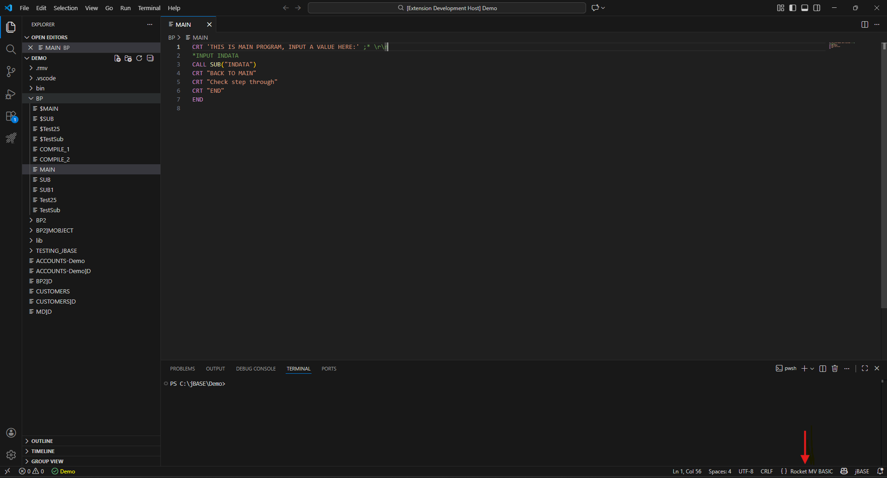

# jBASE Support in MVVS

## Prerequisites:
For jBase, we are using jRemote, which establishes communication with the [jAgent](https://docs.rocketsoftware.com/bundle/jbase_lib_61/page/wci1693826147509.html) service on port 20002 running on the jBase server.
This setup is a prerequisite for establishing a connection with the jBase server.

To enable this, please run the following command in the bin directory of your jBase installation (for example: C:\jBASE\6.2.1\bin):
Command: 

    jbase_agent -L4 -A user

**Note:** MVVS currently supports only user authentication mode. Refer to the jbase_agent wiki to set up user authentication.

## Connection
Refer [Connection](./Connection.md)

## Editing BASIC files
Open BASIC files, set 'rocket-mvbasic' as lanugage for document.

## Compiling BASIC Program Files

1. From editor context [Refer](./Compile.md#from-editor-context)
2. From a file explorer [Refer](./Compile.md#from-a-file-explorer)
3. Through VS Code task [Refer](./Compile.md#through-vs-code-task) 
Also refer [Examples](./Compile.md#jbase-compile-task-examples)
4. Through Command Palette [Refer](./Compile.md#through-command-palette)

### Compilation limitation:
In jBase, the  [BASIC](https://docs.rocketsoftware.com/bundle/jbase_lib_61/page/dyl1666031271431.html) command allows users to pass arguments or options in two places:

Immediately after the BASIC keyword, using the '-' prefix
At the end of the command, using the '(' prefix

In the current MVVS implementation, only the options provided at the end (with the '(' prefix) are supported.

## Catalog BASIC Program Files
### Quick Catalog
Refer [Quick Catalog](./Catalog.md#quick-catalog)

## jBASE Support Matrix

We now support jBASE 5.9 or higher.

| Feature | Status |
| --- | --- |
| Accounts Settings from `db.mvbasic.json` | ❌ Not Supported |
| Catalog Settings in `db.mvbasic.json` | ❌ Not Supported |
| **Compiling BASIC Program Files** |  |  |
| – From editor context | ✅ Supported |
| – From file explorer | ✅ Supported |
| – Through VS Code task | ✅ Supported |
| – Through Command Palette | ✅ Supported |
| Compile & Catalog Configuration in `basic.mvbasic.json` | ✅ Supported |
| Code Lens | ✅ Supported |
| Custom Documentation | ✅ Supported |
| Debugging | ❌ Not Supported |
| Document Symbols | ✅ Supported |
| Diagnostics | ❌ Not Supported |
| File Locking in Online Editing | ❌ Not Supported |
| Code Folding | ❌ Not Supported |
| Formatting Configuration | ⚠️ Partially Supported |
| Group View | ✅ Supported |
| Hashed File Editing (Online Mode) | ❌ Not Supported |
| Hover with brief description | ❌ Not Supported |
| Include Settings (`includeMapping` from `db.mvbasic.json`) | ❌ Not Supported |
| Multiple Workspace Folders Support | ❌ Not Supported |
| Online Editing | ❌ Not Supported |
| Go to References / Find All References (Offline Mode) | ✅ Supported |
| Semantic Highlighting | ❌ Not Supported |
| Auto‑Completion | ❌ Not Supported |
| Go‑To Definition | ❌ Not Supported |
| Rename | ✅ Supported |
| jBASE BASIC | ⚠️ Partially Supported |

### Notes for Partially Supported features
- jBASE BASIC: IntelliSense is not available. Marked partially supported because common syntax shared with UniVerse/UniData BASIC is recognized.
- Formatting Configuration: Most formatting works, but full jBASE BASIC–specific formatting is not yet supported.

