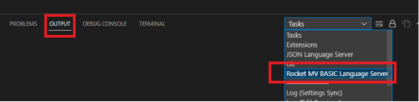

## Log

### Log location

 - Console: From the Console, select "View" > "Output" and then from the OUTPUT panel, select "Rocket MV BASIC Language Server" from the Tasks drop-down.

  

  **Note**: If there is no warning or above level logs generated, then there is no Console output.
 
 - Log file: .rmv\logs\rocket_mv_basic_language_server.log
  
### Log config
 
 - Config file location: .rmv\config\log4j2.properties
 
 - The Extension uses the **log4j2** component. If you already know log4j2, it will be easy to configure the log. You can find related settings in log4j2 official online documentation here: https://logging.apache.org/log4j/2.x/manual/configuration.html . The following are brief description of commonly used options for your reference.

#### property

In most cases,  you will only need to change these properties:

 - property.ROOT_LEVEL: Used to configure the "rootLogger.level". Logger levels include Trace,Debug, Info, Warn, Error, and Fatal. Only logs with levels higher than or equal to the configured level will be available. Root logger level is the first filter. Console or file level is the second filter, only logs that meet both conditions will be printed. Recommended  value is "Info".
  
 - property.CONSOLE_LEVEL: Used to configure the "appender.console.filter.threshold.level". Limits the log level of output to the console. Recommended value is "Warn".
 
 - property.FILE_LEVEL: Used to configure the "appender.all.filter.threshold.level". Limits the log level of output to the file. Recommended value is "trace".

 - property.SERVER_NAME: Used to configure the log output file name. We recommend that this value not be changed. Recommended value is "rocket_mv_basic_language_server".

 - property.LOG_HOME: Used to configure the log output file home path. Recommended value is ".rmv/logs".
  
#### global configuration

 - status: The level of internal Log4j events that should be logged to the console. We recommend that this value not be changed. Recommended value is "error".
 
 - monitorInterval: The minimum amount of time, in seconds, before the file configuration is checked for changes. Recommended value is "5" seconds.

#### rootLogger

Set the rootLogger level and where to place the log file. In addition, you can create appender refs for the logger .

 - rootLogger.level: logger level. Recommended value is "Info"
 
 - rootLogger.appenderRef.console.ref: This value is identical to the value of appender.console.name. We recommend that this value not be changed. Recommended value is "ConsoleAll".

 - rootLogger.appenderRef.all.ref: This value is identical to the value of appender.file.name. We recommend that this value not be changed. Recommended value is "RollingFileAll".

#### appender.console

Appender used to define output to the console:

 - appender.console.type: Suggest not to change. Recommended value is "Console".
 
 - appender.console.name: Suggest not to change. Recommended value is "ConsoleAll".
 
 - appender.console.target: SYSTEM_OUT or SYSTEM_ERR, please only use SYSTEM_ERR here. Because SYSTEM_OUT may cause unexpected error.
 
 - appender.console.layout.type: Includes "JSONLayout", "HTMLLayout", "YMLLayout" and so on. Recommended value is PatternLayout. Recommended value is "PatternLayout".

 - appender.console.layout.pattern: output format. Recommended value is "%d{HH:mm:ss.SSS} [%t] %-5level %logger{36} - %msg%n"

 - appender.console.filter.threshold.level: Refer to "property.CONSOLE_LEVEL". Suggest not to change, "${CONSOLE_LEVEL}".

 - appender.console.filter.threshold.type: Includes "StringMatchFilter", "LevelRangFilter","RegexFilter" and so on. Recommended value is "ThresholdFilter", output log information when log level >= CONSOLE_LEVEL

#### appender.file

Appender used to define output to the file

 - appender.file.type: Suggest not to change. Recommended value is "RollingFile".
 
 - appender.file.name: Suggest not to change. Recommended value is "RollingFileAll".

 - appender.file.filter.threshold.level: Refer to "property.FILE_LEVEL". Fixed value, "${FILE_LEVEL}".

 - appender.file.filter.threshold.type: Refer to "appender.console.filter.threshold.type".

 - appender.file.fileName: Log file absolute path. Recommended value is "${LOG_HOME}/${SERVER_NAME}.log"

 - appender.file.filePattern: file name format. Don't delete "%i" because it is related to "DefaultRolloverStrategy" (unless modify "DefaultRolloverStrategy" to another strategy). Recommended value is "${LOG_HOME}/backup/${SERVER_NAME}.%d{yyyy-MM-dd}-%i.log".

 - appender.file.layout.type: Refer to "appender.console.layout.type".
 
 - appender.file.layout.pattern: output format. Recommended value is "%d{yyyy-MM-dd HH:mm:ss.SSS} [%t] %-5level %logger{36} - %msg%n".
 
 - appender.file.policies.type: Specifies a strategy for scrolling logs. Fixed value, "Policies".
 
 - appender.file.policies.time.type: Child of Policies with value fixed to "TimeBasedTriggeringPolicy". Time-based rolling strategy.
 
 - appender.file.policies.time.interval: Recommended value is "1".

 - appender.file.policies.time.modulate: Indicates whether to adjust the time interval so that the next rollover occurs at the interval boundary. Recommended value is "true".
  
 - appender.file.policies.size.type: Child of Policies with a fixed value of "SizeBasedTriggeringPolicy". The scroll policy based on file size.

 - appender.file.policies.size.size: Policies define the size of each log file. The size can be specified in bytes, suffixed with KB, MB, or GB. Recommended value is "10M".

 - appender.file.strategy.type: Suggest not to change, "DefaultRolloverStrategy". Used to specify the maximum number of log files that can exist in the same folder before the oldest log files are deleted  allowing new log files to be created  (via the max attribute). The default is to keep a maximum of seven files in backup file path.
  
### Examples

**Example 1**

To set the log file level output to info level or higher., you only need to change log file level to info:

 - property.ROOT_LEVEL=Info

 - property.CONSOLE_LEVEL=Info

 - property.FILE_LEVEL=Info

**Example 2**

Set the console output information to debug level or higher and set the log file output information to info level or higher:

 - property.ROOT_LEVEL=Debug

 - property.CONSOLE_LEVEL=Debug

 - property.FILE_LEVEL=Info

**Example 3**

Change the log file size to 20M

 - appender.file.policies.size.size=20M
 