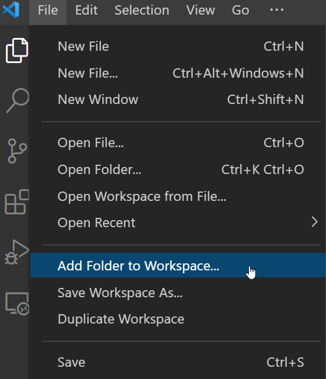

# Multiple Workspace Folders Support

If your source code is located in different account level folders, you can add the folders to the VS Code to view them in one place. Use "File" > "Add Folder to Workspace" to add a workspace folder.

When multiple workspace folders are opened, some functions may operate differently. See the links below for more detail:

- [Configuration Files](./Configuration.md)

- [Group View](./GroupView.md)

- [Connect to U2 Server](./Connection.md)

- [Compile BASIC Programs](./Compile.md)
