## Online Editing

Online Editing is an additional method for modifying BASIC program files on the U2 server. With this feature, users can remotely edit BASIC program files on the U2 server instead of having to retrieve or upload files from a repository. However, it is important to note that users cannot simultaneously utilize this mode alongside the traditional editing mode.

**Note:** VS Code version 1.75 or higher is required to use this feature. Only Windows is supported in this preview version.

### Start Using

Before utilizing this feature, it is necessary for the user to create a new empty folder. This folder will be used to hold the project-related files, including cache files and configuration files, that will be created by this extension. Alternatively, users may opt to open an existing folder dedicated to online editing projects.

**Note:** The presence of both the ".rmv" folder and the ".rmvonline" folder in the same directory should be avoided, as it may result in unexpected issues.

Once the folder is set up, users can initiate the Online Editing functionality by clicking on the Rocket icon located in the left sidebar.

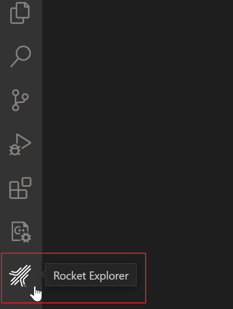

There are three scenarios when you click on that icon:

 - If you have already opened a folder that contains a ".rmv" folder, it indicates that it is an offline project folder. In this case, you will need to open a different folder instead.

 - If you have already opened a folder that contains a ".rmvonline" folder, it signifies that it is an online editing project folder. You can use this folder for online editing.

 - If you open an empty folder, you can use it for online editing, but you will need to initialize it first.

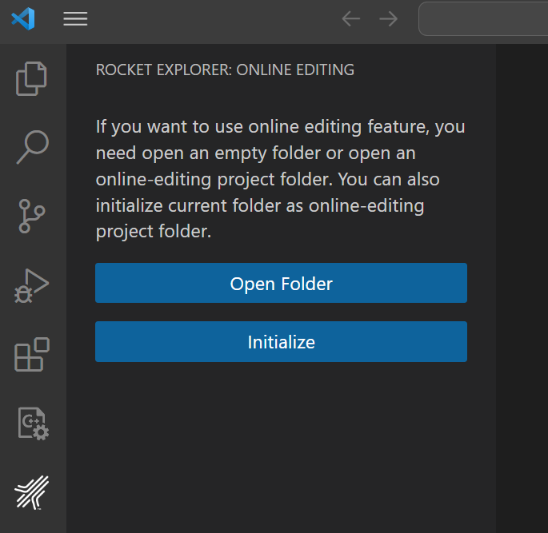

### Configure

If you open an online editing project folder or have initialized an empty folder, you will be able to view a tree structure in the extension.

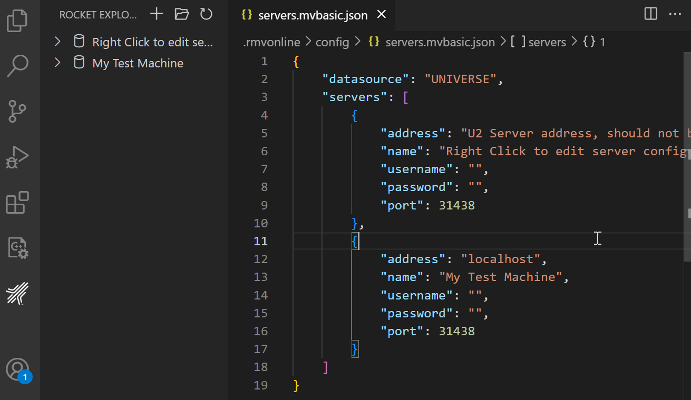

Using this feature, multiple U2 servers are supported. However, it is important to note that you can only connect to one server at a time.

### Configure Server

There are two methods to access the configuration file: 

 - Click the "Open Config" button.

 - Right-click on a tree node and select "Edit Server." 

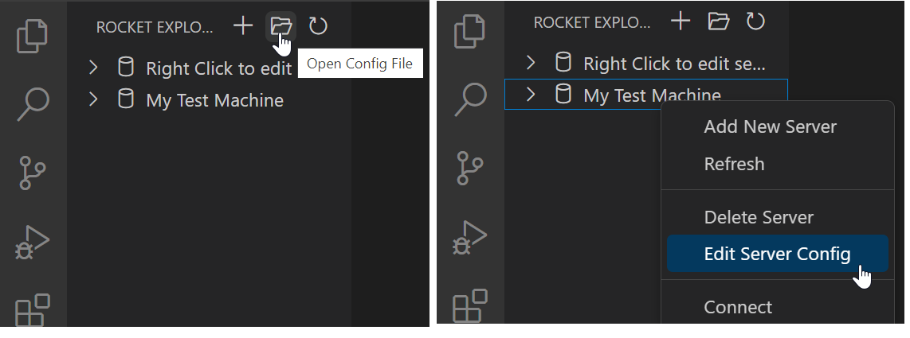

By accessing the configuration file, you can perform actions such as adding, editing, or deleting U2 server configurations.

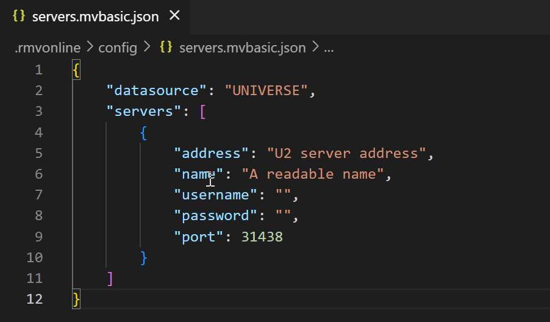

 - **"datasource"**: Must be either UNIVERSE or UNIDATA. In the online editing feature, you can only choose one data source. If you change the data source, the extension must be restarted for the change to take affect.
 
 - **"address"**: Specify the address of the U2 server. 
 
 - **"name"**: Displays a readable name in the tree view. If left empty, the address will be used as the display name. Duplicate names are not supported.
 
 - **"username"**: The username used for logging into the U2 server. If left empty, you will need to provide it in an input box when connecting to the U2 server. 
 
 - **"password"**: The password used for logging into the U2 server. If left empty, you will need to provide it in an input box when connecting to the U2 server. 
 
 - **"port"**: By default, the port is set to 31438, but you can change this according to your U2 server configuration.

There are additional methods available to edit the configuration file: 

 - Right-click on a tree view node and select "Add New Server" to add a new U2 server configuration. 
 
 - Click on the "Add New Server" icon to add a new U2 server configuration. 
 
 - Right-click on a tree view node and select "Delete Server" to remove the configuration of the server from the list.

After making changes to the configuration file, it is necessary to refresh the tree view for the modifications to take effect.

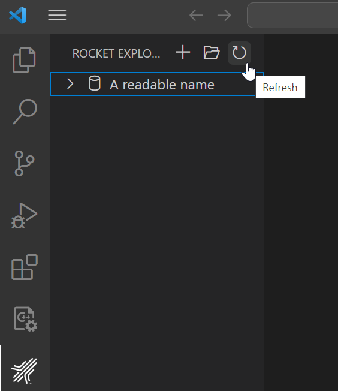

### Connection

To establish a connection, you can right-click on a U2 server node in the tree view and select "Connect". This will initiate the connection to the selected server.

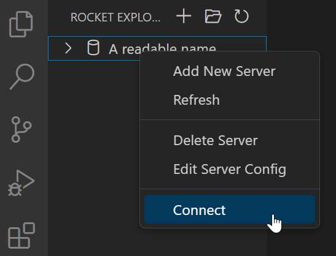

**Note:** When connecting to a U2 server, the extension uses the XDEMO account as default account for UniVerse, and the demo account for UniData. 

If you wish to disconnect from a U2 server, right-click the corresponding server node in the tree view and select "Disconnect". This will terminate the connection to the server.

**Note:** In the online editing feature, the connection icon in the status bar cannot be clicked. This contrasts with the offline mode, where clicking the connection icon allows you to establish or terminate a connection to a server.

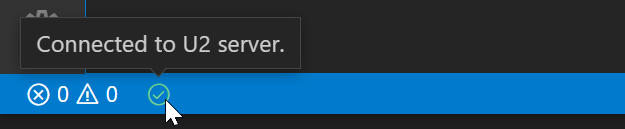

### Editing BASIC programs

Once connected to a U2 server, you can expand the server node to access and view the BASIC program files stored on that server.

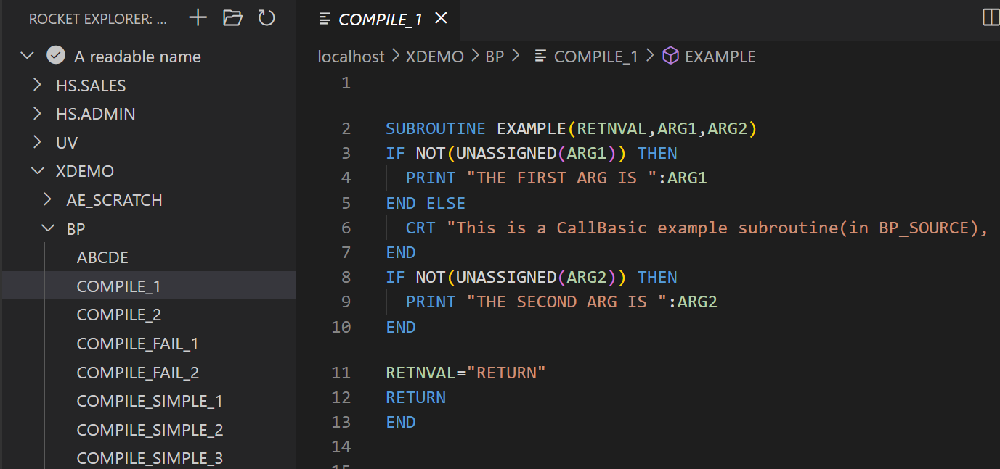

You can also Add or Delete BASIC files:

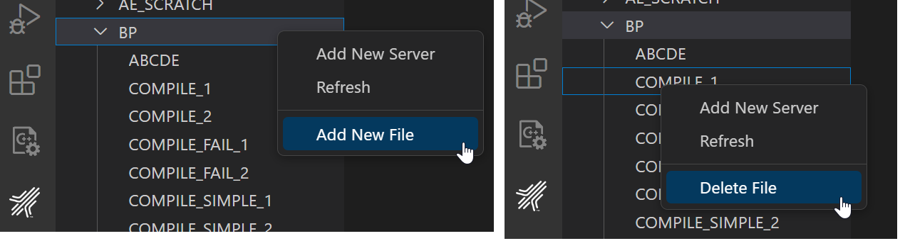

**Note:** Please note that due to access permissions, certain files may not be displayed in the tree view. Additionally, it's important to be aware that not all folders displayed in the tree view will necessarily contain BASIC program files. This is not configurable.

### Synchronization 

Here is the synchronization process when editing a BASIC program file:

1. When opening a BASIC program in the extension online editing mode, the extension will apply a READU lock on the corresponding file on the server side. If the file is already locked on the server side, this request will fail, and an error message will be displayed.

2. Once the file is opened in VS Code, the lock will be released, and a copy will be saved on the VS Code side.

3. When a user saves changes in the extension online editing mode, the extension will attempt to apply a WRITE lock to the file on the server side. If the application of this lock fails, a warning message will be displayed.

4. After successfully applying the WRITE lock to the BASIC file on the server side, the extension will overwrite the corresponding file with the local copy of the BASIC program. All changes made on the server side will be overwritten without warning.

### Compile and catalog
Before using the compilation or catalog functions, a U2 database account must already connected.

#### Quick compile
Users can right-click a BASIC program file and select “” to compile a single file. 

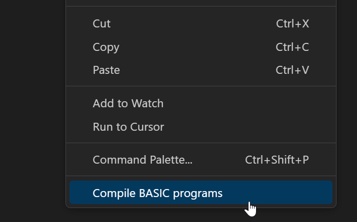

For UniData, there are multiple compilation commands for different flavors.

#### Compile / Catalog with configuration file
The configuration file can help a user to compile and catalog multiple files.
Select “Configure Default Build Task…” from the Terminal menu, and then select “BASIC: Online Editing build” to create a build task.

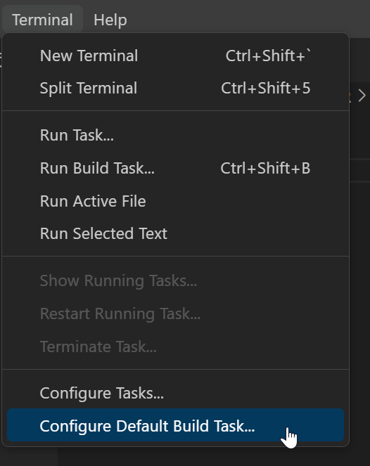

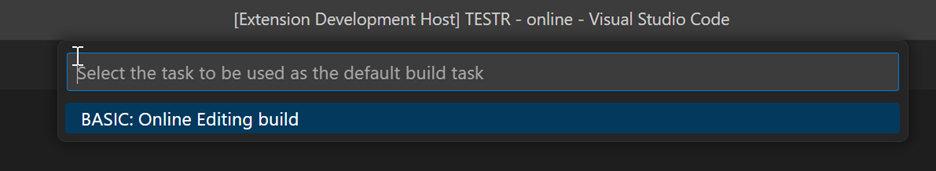

A default task file will be generated. For more information on this file, see the “Compile” documentation.

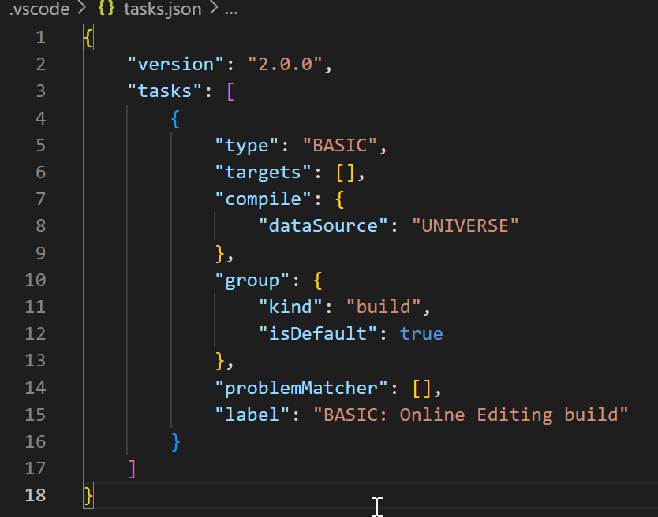

### Limitation:
Most of the LSP (Language Server Protocol) features are supported, but there are some limitations. 

 - Features like Go to Definition, Rename, and Find References may not be able to locate references or definitions in other files. 

 - Debugging related functions are currently not supported. 

 - Custom documentation features are also not supported now. 

 - Please note that only one instance of VS Code can be run at a time.
