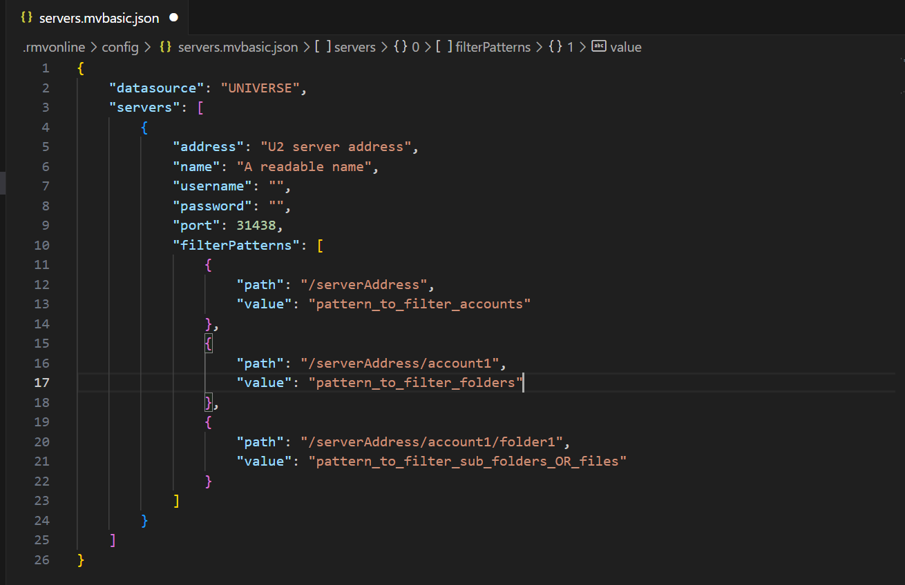

## Online Editing

Online Editing is an additional method for modifying BASIC program files on the U2 server. With this feature, users can remotely edit BASIC program files on the U2 server instead of having to retrieve or upload files from a repository. However, you cannot simultaneously utilize this mode alongside the traditional editing mode.

**Note:** VS Code version 1.75 or higher is required to use this feature. Only Windows is supported in this preview version.

### Start Using

Before utilizing this feature, you must create a new empty folder. This folder will be used to hold the project-related files, including cache files and configuration files, that will be created by this extension. Alternatively, you can opt to open an existing folder dedicated to online editing projects.

**Note:** Do not put both the ".rmv" folder and the ".rmvonline" folder in the same directory as this causes unexpected issues.

Once the folder is set up, initiate the Online Editing functionality by clicking on the Rocket icon located in the left sidebar.


There are three scenarios when you click on that icon:

 - If you have already opened a folder that contains a ".rmv" folder, it indicates that it is an offline project folder. In this case, you will need to open a different folder instead.

 - If you have already opened a folder that contains a ".rmvonline" folder, it signifies that it is an online editing project folder. You can use this folder for online editing.

 - If you open an empty folder, you can use it for online editing, but you will need to initialize it first.


### Configure

If you open an online editing project folder or have initialized an empty folder, you will be able to view a tree structure in the extension.


Using this feature, multiple U2 servers are supported. However, it is important to note that you can connect to only one server at a time.

### Configure Server

There are two methods to access the configuration file: 

 - Click the "Open Config" button.

 - Right-click on a tree node and select "Edit Server." 


By accessing the configuration file, you can perform actions such as adding, editing, or deleting U2 server configurations.



 - **"datasource"**: Must be either UNIVERSE or UNIDATA. In the online editing feature, you can only choose one data source. If you change the data source, the extension must be restarted for the change to take effect.
 
 - **"address"**: Specify the address of the U2 server. 
 
 - **"name"**: Displays a readable name in the tree view. If left empty, the address will be used as the display name. Duplicate names are not supported.
 
 - **"username"**: The username used for logging into the U2 server. If left empty, you will need to provide it in an input box when connecting to the U2 server. 
 
 - **"password"**: The password used for logging into the U2 server. If left empty, you will need to provide it in an input box when connecting to the U2 server. 
 
 - **"port"**: By default, the port is set to 31438, but you can change this according to your U2 server configuration.

 - **"account"**: The account name used for connecting to the U2 server. If left empty, you will need to provide it in an input box when connecting to the U2 server.
   - ***Note:*** Previously, when connecting to a U2 server, the extension used the XDEMO account as the default account for UniVerse, and the demo account for UniData.

 - **"filterPatterns"**_(Optional)_: Used to specify filter patterns for Accounts, Folders and Files.

There are additional methods available to edit the configuration file: 

 - Right-click on a tree view node and select "Add New Server" to add a new U2 server configuration. 
 
 - Click on the "Add New Server" icon to add a new U2 server configuration. 
 
 - Right-click on a tree view node and select "Delete Server" to remove the configuration of the server from the list.

After making changes to the configuration file, you must refresh the tree view for the modifications to take effect.


### Connection

To establish a connection, you can right-click on a U2 server node in the tree view and select "Connect". This will initiate the connection to the selected server.


If you wish to disconnect from a U2 server, right-click the corresponding server node in the tree view and select "Disconnect". This will terminate the connection to the server.


**Note:** In the online editing feature, the connection icon in the status bar cannot be clicked. This contrasts with the offline mode, where clicking the connection icon allows you to establish or terminate a connection to a server.


### Filtering

You can establish filters to filter out information you do not want MVVS to display. You can configure MVVS to filter out certain filenames to minimize the number of unnecessary files listed.

In the Configure Patterns option, enter the account/folder/file name patterns you want to match. Separate each pattern with a comma. Pattern matching characters are:
 * \* = any string
 * ? = any character

#### **Steps to Configure Filter Pattern**
**Access Configuration**:
* Right-click the server name, account, or folder.
* Select the "Configure Pattern" option.


**Enter Filter Pattern**:
* Add your desired filter pattern to the servers.mvbasic.json file.
* Save the changes.

**Refresh Connection**:
* If you are already connected to the server, manually refresh it to apply the changes.

**View Filtered Results**:
* Expand the specific server or folder to see only the filtered accounts, folders, and files.

### Search BASIC programs

Users can search for BASIC programs within a folder. Users can specify a search pattern or text to find specific files. This feature is designed for quick access to files, eliminating the need to scroll through the VS Code file view.

In the Search option, enter the file name pattern you want to match. Pattern matching characters are:
 * \* = any string
 * ? = any character

#### **Steps to Search BASIC programs**
**Access Configuration**:
* Right-click the folder inside Account.
* Select the "Search" option.


**Enter Search Pattern**:
* Enter the file name or search criteria and click Enter.


**View Search Results**:
* Users can view search result in "SEARCH RESULTS" view and open files directly from that view.


### Editing BASIC programs

Once connected to a U2 server, you can expand the server node to access and view the BASIC program files stored on that server.

When you open a program file for editing, the MVVS extension automatically detects the language based on the file extension:

- Files with a `.py` extension are recognized as **Python**.
- Files with a `.json` extension are recognized as **JSON**.
- **BASIC files**, however, are **not auto-detected** and you must manually set the language mode to **Rocket MV BASIC**.

There are **three ways** to set the language mode for BASIC files:

#### 1. Configure language association in `settings.json`

You can configure VS Code to recognize BASIC files by associating filepaths or names with the Rocket MV BASIC language.

- **To apply the language mode to all files under the `BP` folder**:
  ```json
  "files.associations": {
      "**/BP/**": "rocket-mvbasic"
  }
- **To apply it to a specific file, such as TESTSUM**:
  ```json
  "files.associations": {
    "TESTSUM": "rocket-mvbasic"
  }
- **Full example configuration:**:
    ```json
    {
        "[rocket-mvbasic]": {
            "editor.codeLens": false
        },
        "files.associations": {
            "**/BP/**": "rocket-mvbasic",
            "**/.rmv/config/*.json": "jsonc"
        },
        "files.exclude": {
            "**/.git": true,
            "**/.svn": true,
            "**/.hg": true,
            "**/CVS": true,
            "**/.DS_Store": true,
            "**/Thumbs.db": true,
            "**/.rmv/catalog/**": true,
            "*/_*": false
        }
    }
#### 2. Use the Command Palette
You can manually change the language mode using the VS Code Command Palette:

 1. Press Ctrl+Shift+P to open the Command Palette.
 2. Type and select “Change Language Mode”.
 3. Choose “Rocket MV BASIC” from the list of languages.

#### 3. Use the status bar language selector
You can also change the language mode via the status bar.
At the bottom-right of VS Code, you'll see the current language mode, for example, Plain Text, JSON.

 1. Click on the current language mode. A language selection menu displays.
 2. Select Rocket MV BASIC from the list.


You can also Add or Delete BASIC files:


**Note:** Due to access permissions, certain files may not be displayed in the tree view. Additionally, it's important to be aware that not all folders displayed in the tree view will necessarily contain BASIC program files. This is not configurable.

### Synchronization 

Here is the synchronization process when editing a BASIC program file:

1. When opening a BASIC program in the extension online editing mode, the extension will apply a READU lock on the corresponding file on the server side. If the file is already locked on the server side, this request will fail, and an error message will be displayed.

2. Once the file is opened in VS Code, the lock will be released, and a copy will be saved on the VS Code side.

3. When a user saves changes in the extension online editing mode, the extension will attempt to apply a WRITE lock to the file on the server side. If the application of this lock fails, a warning message will be displayed.

4. After the WRITE lock to the BASIC file on the server side is successfully applied, the extension will overwrite the corresponding file with the local copy of the BASIC program. All changes made on the server side will be overwritten without warning.

### Compile and catalog
Before using the compilation or catalog functions, a U2 database account must already connected.

#### Quick compile
Users can right-click a BASIC program file and select “” to compile a single file. 


For UniData, there are multiple compilation commands for different flavors. Refer to [UD Compilation here](./Compile.md#unidata-compile-flavor-in-basicmvbasicjson-file)

#### Quick catalog
Users can right-click a BASIC program file and select "Catalog" to catalog a single file for both Universe and Unidata databases. 


 
Clicking on 'Catalog' will use the parameters from the basic.mvbasic.json file to catalog the file. If you need to change the catalog type, arguments, or initial character, please update the settings in this file. See [Catalog Settings in "basic.mvbasic.json" file](./Catalog.md#quick-catalog) for more information.

#### Compile / Catalog with configuration file
The configuration file can help you to compile and catalog multiple files.
Select “Configure Default Build Task…” from the Terminal menu, and then select “BASIC: Build” to create a build task.


A default task file will be generated. For more information on this file, see the “Compile” documentation.


### Debugging in online mode
Refer [Debugging](./Debugging.md) for debugging steps.

### Limitation:
Most of the LSP (Language Server Protocol) features are supported, but there are some limitations. 

 - Features like Go to Definition, Rename, and Find References may not be able to locate references or definitions in other files. 

 - Debugging related functions are not supported. 

 - Custom documentation features are not supported. 

 - Only one instance of VS Code can be run at a time.

 - Do not click on another account's folder before completing the cataloging of the current BASIC program. Doing so may result in cataloging the wrong BASIC program on the U2 server side. 

 - The parameter "arguments" in the basic.mvbasic.json file is not supported by the catalog feature. By default, the argument is set to FORCE for both the UV and UD databases.