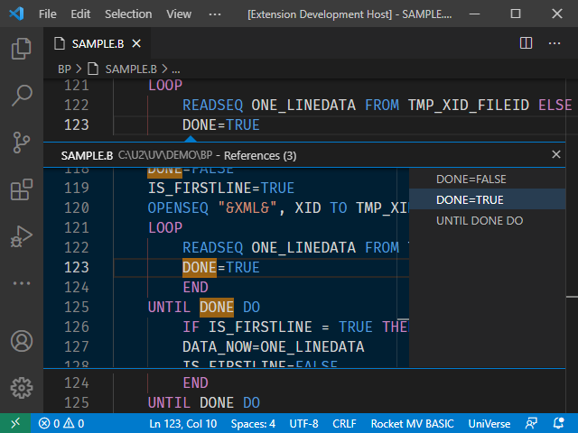
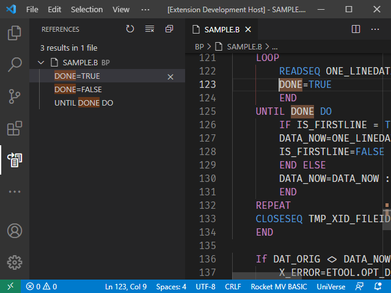

## Using References

Open a BASIC program file, right-click a symbol and then select `Go to References` or `Find All References`.

If you select `Go to References` and there are multiple references of the symbol, an embedded window opens in current document. 

If only one reference exists, the cursor will jump to its location.

If select `Find All References`, the results will be listed in a side window.

