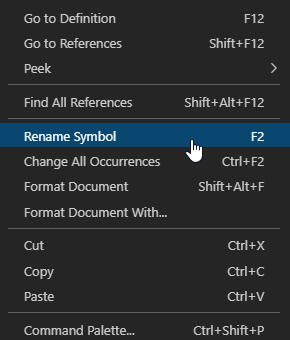

## Rename Usage

Open a BASIC program file, and then right-click a symbol and select the `Rename Symbol` menu option to rename all occurrences of the symbol.

Or move the cursor to a symbol then press <kbd>F2</kbd>.

**Note**: only symbols in the currently opened file are impacted. Files referenced in the INCLUDE statement are not impacted.

