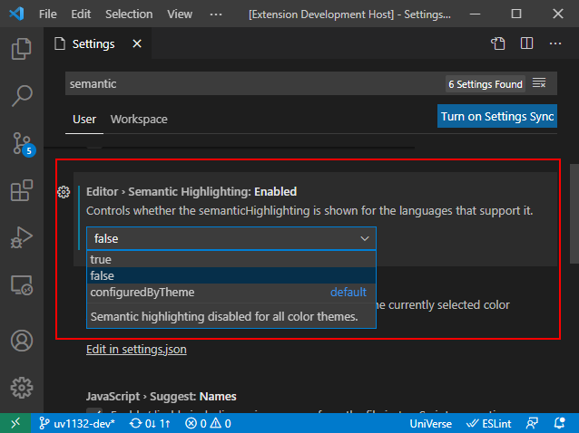
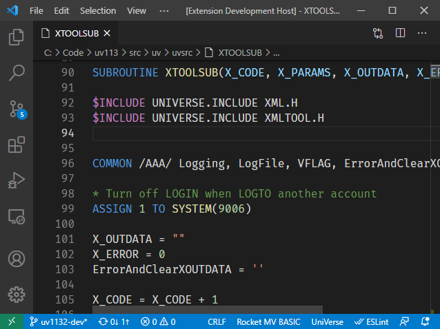
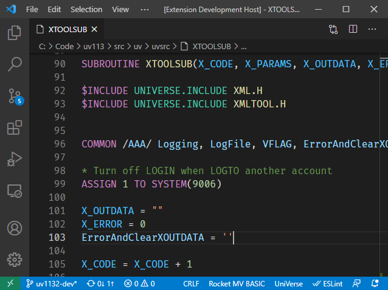
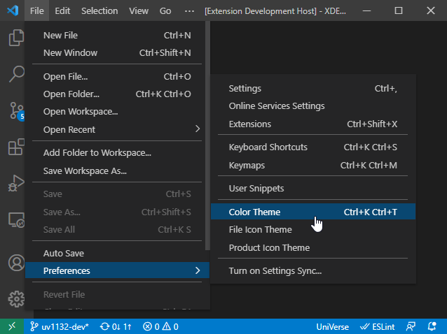

## Semantic Highlighting

When semantic highlighting is enabled, all symbols are highlighted with different colors based on the syntax.

You can enable / disable semantic highlighting in the VS Code settings. Press <kbd>F1</kbd> to open the command window, and then enter "*Open Settings (UI)*". Search "*semantic*" to find the `Editor>Semantic Highlighting item`. Set the value to `true` to enable semantic highlighting; otherwise set it to `false`.

Without semantic highlighting:

With semantic highlighting:

**Note**: It is suggested that you use **Dark+** color theme of the VS Code. Otherwise, the semantic highlighting colors may be stand out visually.

Use the following menu items to select VS Code color themes. (This is VS Code’s functionality)

