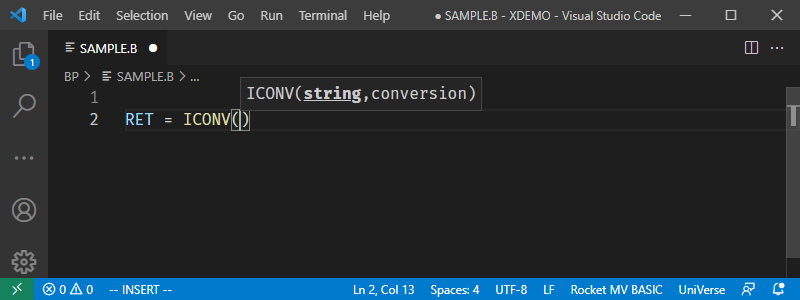
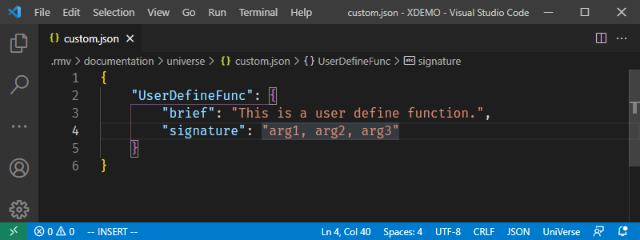

# Signature Help

When users call Basic internal or customized functions, the Signature Help feature automatically prompts for the parameters of the function.

Users can add the parameter list of the customized function in the corresponding configuration file.

Open the customized functions configuration file from the appropriate directory:

- **For UniVerse**: `.rmv/documentation/universe/custom.json`

- **For UniData**: `.rmv/documentation/unidata/custom.json`

then add a new function and parameters list.

- `brief`: A brief description of this function. See the Customize Documentation for more detail.
- `signature`: Parameters list. All parameter names should be listed in one string.

When this customized function is called in a BASIC program, the parameters will be prompted automatically.

